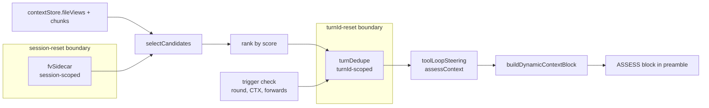

# ASSESS — Pinned Working-Memory Hygiene

**ASSESS** is an ephemeral steering signal that surfaces the model's oldest / largest pinned targets and asks for a per-row decision — `release`, `compact`, or `hold` — before any new read. It's the hygiene counterpart to the spin circuit breaker: same injection slot, same `toolLoopSteering` pipeline, but driven by **resource state** (pinned tokens, idle rounds, silent edit-forwarding) rather than behavior patterns.

Source: [`services/assessContext.ts`](../atls-studio/src/services/assessContext.ts); tests in [`services/assessContext.test.ts`](../atls-studio/src/services/assessContext.test.ts); injection in [`services/aiService.ts`](../atls-studio/src/services/aiService.ts) `buildDynamicContextBlock`; protocol cached in [`prompts/cognitiveCore.ts`](../atls-studio/src/prompts/cognitiveCore.ts).

## Why this exists

Unpinned chunks dematerialize after one round by design ([cognitiveCore.ts](../atls-studio/src/prompts/cognitiveCore.ts) lines 13-22). Everything volatile — searches, tool results, exec output — rolls automatically. The only memory that accumulates is **pinned** state, and per the FileView contract there is **exactly one FileView per file path** ([fileViewStore.ts](../atls-studio/src/services/fileViewStore.ts) line 56; `contextStore.fileViews: Map<string, FileView>`). So the cleanup surface is a short list of *files*, not duplicated views.

The silent accumulator the Cognitive Core explicitly warns about:

> *edit-forwarded pins (pinned h:OLD -> pinned h:NEW) accumulate silently otherwise*

These are single entries in `fileViews` whose `pinned` state survives multiple edit auto-forwards without the model ever touching the view again. Same map entry, new revision, stale intent. ASSESS detects this via a session-scoped sidecar that tracks revision changes between `lastAccessed` advances.

## Where it fires

Injected into the state preamble by `buildDynamicContextBlock()` immediately after the spin circuit-breaker block:

```
## HASH MANIFEST
...
<<TASK: ...>> <<CTX 128k/200k (64%)>>
<<SYSTEM: SPIN — ...>>              ← corrective steering (spin)
<<ASSESS: CTX 62% ...>>             ← hygiene steering (ASSESS)
## PROJECT STRUCTURE
...
```

Corrective first, hygiene second. Both can fire in the same round without conflict. Both sit after the BP3 boundary in the uncached tail, so firing does not invalidate the cached history prefix.

## Shape of the emitted block

```text
<<ASSESS: CTX 62% (128k/200k). 3 pinned targets bloating WM. Decide before next read:
  h:a1b2cd  src/services/aiService.ts        9.4k  idle:4r (pin survived 2 edits untouched)
  h:c3d4ef  src/prompts/cognitiveCore.ts     3.1k  idle:6r
  h:e5f6ab  src/utils/toon.ts                2.8k  idle:3r
Per row: release (pu hashes:h:X) | compact (pc hashes:h:X tier:sig) | hold (no-op; cite why).>>
```

- **One row per pinned file / artifact.** Identities are the stable `h:<short>` retention refs from `computeFileViewHash(path, revision)` — the same hash the model pinned originally, auto-forwarded through any edits. Refs share the `h:<short>` namespace with chunks; the runtime resolves either.
- **`idle:Nr`** — rounds since `lastAccessed` last advanced.
- **`pin survived K edits untouched`** — `K` revision bumps happened while the view was idle (the silent accumulator signal).
- **K ≤ 5 rows** by default (`maxCandidates`); token-budget gated under 300 BPE tokens even at max-K (verified by [assessContext.test.ts](../atls-studio/src/services/assessContext.test.ts)).

## Trigger model (two paths)

`evaluateAssess()` runs once per round (skipped for `ask` / `retriever` modes) and publishes `toolLoopSteering.assessContext`.

| Path | Condition | Intent |
|---|---|---|
| **User-turn boundary** | `round === 0` AND total candidate tokens ≥ `boundaryMinTokens` (default 1000) | Let the model clean house carried over from the prior user turn before starting a new request. |
| **Mid-loop** | `ctxPct ≥ midLoopCtxThreshold` (default 80) OR a new edit-forwarded pin appeared since the last evaluation | Catch runaway pressure or silent accumulation during an ongoing tool loop. |

Neither path is a hard gate — ASSESS is guidance only; the loop continues regardless of whether the model acts on it.

## Candidate selection

Two source pools, filtered by exclusion rules and sorted by score. Source of truth: `contextStore.fileViews` + `contextStore.chunks`.

### Pool 1: pinned FileViews

- **Include** when `idleRounds >= idleRoundsMin` (default 2) OR the path is outside the active task-plan scope (if one is set).
- **Exclude** when `view.freshness === 'suspect'` (needs `rec`, not cleanup) or the view's hash is in the caller-supplied `suspectChunkHashes` set.

### Pool 2: pinned non-FileView artifacts (`search`, `symbol`, `deps`, `analysis`, `issues`, `result`, `call`)

- **Include** when `chunk.pinned && chunk.tokens >= artifactMinTokens` (default 1000) AND `idleRounds >= artifactIdleRoundsMin` (default 3).
- **Exclude** when covered by a pinned FileView (deduped via `fileViewCoveredChunkHashes`), recently cited by an active BB finding, suspect, or `freshness === 'changed' | 'suspect'`.

Both pools exclude: unpinned anything, chat message chunks, and BB entries themselves (durable by contract).

## Ranking

Single score, one row per file / artifact:

```
score = tokens * (idleRounds + 2 * survivedEditsWhileIdle)
      + (outOfSubtaskScope ? tokens * 0.5 : 0)
```

- **`tokens`** — filled-region tokens for FileViews; `chunk.tokens` for artifacts.
- **`idleRounds`** — derived from `Date.now() - lastAccessed` divided by `roundMs` (default 30s, injectable for tests).
- **`survivedEditsWhileIdle`** — revision bumps observed on the view while `lastAccessed` did not advance. Tracked by a module-private `fvSidecar: Map<filePath, { revisionAtLastAccess, lastAccessedSeen, forwardsWhileIdle }>` that survives turn boundaries (session-scoped, reset on session reset via `resetAssessContext`).

The `2×` weight on `survivedEditsWhileIdle` biases the list toward the specific accumulator pattern the Cognitive Core names. Scope mismatch contributes a milder nudge (`0.5 × tokens`) so fresh but out-of-scope views still surface.

Top-K by descending score; hard cap at `maxCandidates` (default 5, max 8 rows).

## Single-fire dedupe

Goal: fire exactly once per "distinct cleanup situation" per user turn.

```
firedKey = `${ctxBucket}:${sortedCandidateHashes}`   // 'mid' | 'hi'
ctxBucket = ctxPct >= midLoopCtxThreshold ? 'hi' : 'mid'
```

Stored in module-private `turnDedupe: Map<turnId, { lastFiredKey, lastCtxBucket }>`. Rules:

- **First fire per turn** (empty `lastFiredKey`) → fire unconditionally when any trigger holds.
- **Same candidates, same bucket** → no re-fire. This is the main dedupe path.
- **New candidate added / removed** → re-fire with the updated list.
- **CTX climbs from `mid` to `hi`** → re-fire (composition unchanged but pressure escalated).
- **CTX descends from `hi` to `mid`** with same candidates → no re-fire (quieter on release).
- **New user turn** (`turnId` changes) → dedupe state resets naturally; sidecar persists so idle-round math stays correct.

## State layout



Two distinct lifetimes:

- **Session-scoped** `fvSidecar` — cleared only by `resetAssessContext()`, called from the session reset path in [aiService.ts](../atls-studio/src/services/aiService.ts) alongside `resetSpinCircuitBreaker()`. Survives turn boundaries so `survivedEditsWhileIdle` math works across user messages.
- **Turn-scoped** `turnDedupe` — keyed by `turnId` (== `sessionId` in the current main chat loop). New user turn → fresh dedupe state. Older turn entries are harmless; memory footprint is O(active turns × candidate-hash-length).

## The cached protocol (BP-static)

A single short paragraph lives in `COGNITIVE_CORE_BODY` under **MEMORY MODEL**:

```
ASSESS protocol: when you see <<ASSESS: ...>> in the preamble, the runtime has surfaced
your oldest/largest pinned targets. Before any new read, emit exactly one action per
listed h: — release (pu), compact (pc tier:sig), or hold (no-op; cite why it must stay).
Ignoring ASSESS does not fail the turn, but the same candidates will re-surface if
pressure climbs.
```

This is the full contract the model needs. The ephemeral block carries the *data* (which refs, why); the cached protocol carries the *contract* (what actions mean). Keeping the protocol in BP-static amortizes teaching cost to near-zero after round 1, while the mutable block stays lean (80-300 tokens on fire, 0 otherwise).

## Tunable options

Passed as the second argument to `evaluateAssess(input, opts)`:

| Option | Default | Purpose |
|---|---:|---|
| `idleRoundsMin` | 2 | Minimum idle rounds for a pinned FileView to be a candidate. |
| `artifactIdleRoundsMin` | 3 | Same for non-FileView artifacts (stricter — they're usually genuinely transient). |
| `artifactMinTokens` | 1000 | Floor for artifact inclusion; smaller pins are not worth surfacing. |
| `maxCandidates` | 5 | Hard cap on rows emitted in the block. |
| `midLoopCtxThreshold` | 80 | Mid-loop trigger threshold in CTX percent. |
| `boundaryMinTokens` | 1000 | Minimum total candidate tokens on a user-turn boundary fire. |

## Observability

- **Debug log on fire** in the round loop: `[assess] fired round=N ctxPct=P candidates=K topTokens=T`.
- **`RoundSnapshot`** carries optional diagnostic fields `assessFired`, `assessFiredKey`, `assessCandidateCount` on every round (forward-compat; no read-back yet — persisted via normal `roundHistorySnapshots` flow in session saves).
- **`getAssessContextState()`** returns `{ fvSidecarSize, turnCount }` for UI / telemetry surfaces. The spin circuit-breaker exposes a comparable readout; ASSESS follows the same idiom.

## Measurement gate

Per [atls-pillars.mdc](../.cursor/rules/atls-pillars.mdc), the decision gate for any steering change:

- **Token overhead** — verified statically in [assessContext.test.ts](../atls-studio/src/services/assessContext.test.ts): the max-K=5 block is bounded under 300 BPE tokens; single-candidate under 100. Fire rate × avg block tokens × round count should remain ≤ 10% of the state preamble budget.
- **Rounds-to-convergence** — paired A/B (`assessContext` feature on/off) on representative multi-round sessions. Track median CTX, total rounds, whether `task_complete` succeeds without emergency compaction.
- **Comprehension** — verify the model emits `{release | compact | hold}` actions when ASSESS fires (not re-reads or unrelated tool calls). Visible in the next batch for inspection.

Ship criterion: overhead ≤ 10%, no regression in rounds-to-convergence, at least one session shows CTX-trajectory improvement or avoided emergency eviction. The static half is enforced in CI via vitest; the live half is operator-driven.

## Interaction with other subsystems

| Subsystem | Relationship |
|---|---|
| **Spin circuit breaker** | Sibling, publishes through the same `toolLoopSteering` surface. Spin block renders first (corrective); ASSESS second (hygiene). Independent triggers — both can fire in one round. |
| **Retention-op compaction** | Same goal (kill ghost-ref surface from pin/unpin/drop/unload/compact/bb.delete), different layer. ASSESS acts on **live pinned state** the current round — "here are the candidates, decide." Retention-op compaction acts on **persisted tool-call history** after the round ends — "the hashes you already unpinned are gone, don't re-emit them." See [`history-compression.md`](history-compression.md#retention-op-compaction). |
| **Auto-pin on read** | Upstream source of pin candidates. Under `autoPinReads: true` (default), every read auto-pins its FileView — so ASSESS sees more candidates, which is exactly what the ranking formula is designed for (`tokens × (idleRounds + 2 × survivedEditsWhileIdle)` surfaces large-and-idle regardless of pin source). Counter-metric for "is auto-pin too aggressive?" lives in the auto-pin telemetry path, not here. See [`auto-pin-on-read.md`](auto-pin-on-read.md). |
| **FileView render** | ASSESS does not mutate views. The model's response (`pu` / `pc`) flows through the normal batch handlers and updates the store the same way as any other pin change. |
| **Freshness** | `freshness === 'suspect'` / `'changed'` entries are **excluded** from candidates — they need `rec` or refresh, not cleanup. `canSteerExecution` is not invoked here (that gate covers steering content, not memory hygiene). |
| **Pressure response bullets in Cognitive Core** | Cached rules (`<50%` / `50-80%` / `80-95%` / `>95%`) describe *what* actions to take at each band. ASSESS provides *which* specific refs to act on — the missing activation cue between rules and state. |
| **HPP auto-compaction** | ASSESS does not replace the `>95%` emergency floor. That still owns the stop-the-world path. ASSESS fills the 50-95% band where the model's judgment beats a blanket sweep. |

## Extending

Likely future knobs, in priority order:

1. **BB candidate surfacing** — currently excluded because BB is durable by contract. Post-ship data may show "progress note rot" (non-finding BB entries accumulating). If so, add a separate pool gated on kind/freshness.
2. **UI fire history** — a small row under the Spin Trace section in `AtlsInternals` showing the last N ASSESS fires, their candidates, and the model's action. Low-cost; defer until live A/B data shapes the layout.
3. **Tiered auto-action at `hi + repeat`** — if the model ignores two consecutive fires with the same candidates while in `hi` bucket, runtime could auto-`pc tier:sig` the top candidate. Not implemented — the current design chose single-fire without runtime autonomy (reversible if live data warrants).
