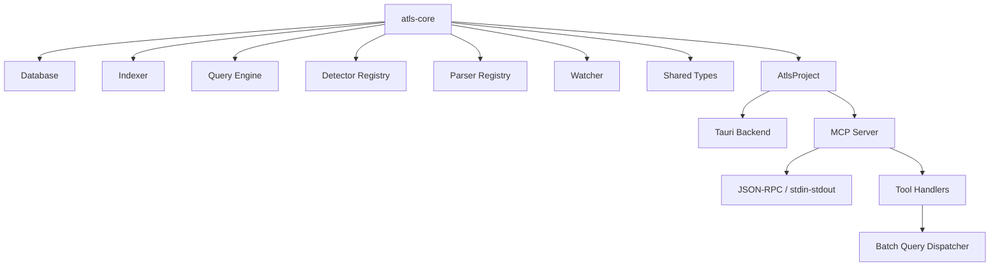

# ATLS Engine

## What It Is

The ATLS engine is the reusable Rust code-intelligence layer centered on `atls-rs/crates/atls-core`. It provides project indexing, parsing, querying, detector loading, and related project services that higher-level hosts can embed.

In this repository, the main host is the Tauri desktop backend, and the secondary host is the MCP server (`atls-rs/crates/atls-mcp`).

## Why It Exists

ATLS Studio needs a language-aware backend that can:

- scan and index codebases
- persist analysis data in SQLite
- answer structural and search queries
- load issue-detection patterns
- watch for file changes

Those capabilities should be reusable across multiple hosts instead of being tied only to the desktop app. `atls-core` is that shared engine boundary.

## Main Responsibilities

- Manage the project database and schema.
- Build and update indexes over source files.
- Parse code through parser registries and language integrations.
- Run queries for search, symbols, issues, files, and context.
- Load detector patterns and expose higher-level project services through `AtlsProject`.
- Extract and track cross-file relationships (imports, calls, file relations).
- Provide vector-based hybrid search alongside FTS.
- Preprocess C-family sources to improve tree-sitter parse quality.

## Key Code Locations

| Path | Purpose |
|---|---|
| `atls-rs/crates/atls-core/src/lib.rs` | Top-level module exports |
| `atls-rs/crates/atls-core/src/project.rs` | `AtlsProject` — wires engine components together |
| `atls-rs/crates/atls-core/src/db/` | Database layer: schema, migrations, queries |
| `atls-rs/crates/atls-core/src/indexer/` | Indexing, scanning, symbol extraction, relation tracking |
| `atls-rs/crates/atls-core/src/query/` | Query engine: search, symbols, issues, files, graphs, context |
| `atls-rs/crates/atls-core/src/detector/` | Detector registry, pattern loading, tree-sitter detection |
| `atls-rs/crates/atls-core/src/parser/` | Parser registry, language loading, query execution |
| `atls-rs/crates/atls-core/src/watcher/` | File watching and filtering |
| `atls-rs/crates/atls-core/src/types/` | Shared types: files, symbols, issues, patterns, fixes, UHPP |
| `atls-rs/crates/atls-core/src/preprocess.rs` | C/C++ macro preprocessing for tree-sitter |

## Engine Structure

`atls-core` exposes a small set of foundational modules:

```
atls-core/src/
├── lib.rs              # re-exports public API
├── project.rs          # AtlsProject entry point
├── preprocess.rs       # C-family macro stripping
├── db/
│   ├── mod.rs          # Database struct, open/close
│   ├── schema.rs       # CREATE TABLE definitions
│   ├── migrations.rs   # incremental schema migrations
│   └── queries.rs      # low-level insert/get helpers
├── indexer/
│   ├── scanner.rs      # file walk, incremental scan, progress
│   ├── symbols.rs      # DEPRECATED tree-sitter SymbolExtractor (replaced by uhpp_extractor)
│   ├── relations.rs    # import/call extraction per language
│   ├── fallback_extractor.rs  # regex fallback for unsupported langs
│   └── uhpp_extractor.rs      # UHPP artifact + symbol extraction
├── query/
│   ├── mod.rs          # QueryEngine struct + shared helpers
│   ├── search.rs       # code search, FTS, reranking (~2k lines)
│   ├── symbols.rs      # symbol lookup, usage, call hierarchy (~2.3k lines)
│   ├── context.rs      # smart/module/component context assembly
│   ├── files.rs        # file graph, subsystems, change impact
│   ├── issues.rs       # issue filtering, grouping, noise marking
│   ├── graph.rs        # file-graph and symbol-graph queries
│   ├── hybrid.rs       # vector index, cosine similarity, RRF
│   ├── feedback.rs     # symbol selection boost tracking
│   ├── grammar.rs      # PEG grammar for structured queries
│   ├── structured.rs   # structured query parsing
│   └── llm_query.rs    # LLM-based query interpretation stub
├── detector/
│   ├── loader.rs       # load patterns from JSON catalog files
│   ├── registry.rs     # DetectorRegistry + FocusMatrix
│   ├── runner.rs       # DetectionRunner orchestration
│   └── treesitter.rs   # TreeSitterDetector — pattern → issue
├── parser/
│   ├── languages.rs    # tree-sitter language loading
│   ├── registry.rs     # ParserRegistry with query cache
│   ├── query.rs        # compile_query / execute_query
│   └── captures.rs     # Capture / QueryMatch extraction
├── watcher/
│   ├── events.rs       # Watcher, WatcherEvent, WatcherHandle
│   └── filter.rs       # FileFilter, .atlsignore, skip-dir logic
└── types/
    ├── file.rs         # Language enum, FileInfo, FileRelationType
    ├── symbol.rs       # SymbolKind (29 variants)
    ├── issue.rs        # IssueSeverity, ParsedIssue, Issue
    ├── pattern.rs      # Pattern, PatternSeverity, PatternCategory
    ├── fix.rs          # CodeFix, FixPayload, FileToCreate
    └── uhpp.rs         # UHPP protocol types (~2.5k lines)
```

### Optional Cargo features

`atls-core` exposes a `neural-embeddings` feature in [`atls-rs/crates/atls-core/Cargo.toml`](../atls-rs/crates/atls-core/Cargo.toml) that enables the `ort` (ONNX Runtime) + `ndarray` dependencies. With the feature off (the default), the hybrid search path uses the `DeterministicProvider` (hash-based embeddings) and skips the ONNX model loading path. This keeps binary size and startup cost down for hosts that don't need neural retrieval.

## Module Details

### `project` — AtlsProject

`AtlsProject` is the compositional entry point. Its fields are **private**; all access goes through accessor methods. The real struct in [`atls-rs/crates/atls-core/src/project.rs`](../atls-rs/crates/atls-core/src/project.rs) ~27-34:

```rust
pub struct AtlsProject {
    root_path: PathBuf,
    db: Arc<Database>,
    indexer: Arc<Mutex<Indexer>>,
    query: Arc<QueryEngine>,
    detector: Arc<Mutex<DetectorRegistry>>,
    parser_registry: Arc<ParserRegistry>,
}
```

On `open()` (or `open_with_patterns_fallback()`), it:

1. Canonicalizes the root path and creates the `.atls/` directory.
2. Opens (or creates) the SQLite database at `.atls/atls.db` in WAL mode.
3. Searches a list of candidate patterns directories in order: `patterns/`, `atls-rs/patterns/`, `patterns/catalog/`, `.atls/patterns/`, then the optional bundled fallback path.
4. Initializes `ParserRegistry`, `Indexer` (wired to the discovered patterns directory), `QueryEngine`, and `DetectorRegistry`.
5. Loads detector patterns from the same discovered directory.

This root-scoped project abstraction is what lets different hosts reuse the same engine behavior against the same codebase.

### `db` — Database Layer

**`Database`** wraps a `rusqlite::Connection` with `open()` / `open_in_memory()` constructors. It configures WAL mode and busy timeouts on creation.

**`DatabaseSchema`** defines the core tables:

- `files` — indexed source files with path, hash, language, line count.
- `symbols` — extracted symbols with kind, line range, signature, complexity, metadata.
- `code_issues` — detected issues with severity, category, pattern reference.
- `file_relations` — import/call/dependency edges between files.
- `symbol_fts` — FTS5 virtual table for full-text symbol search.
- `code_signatures` — structural signature hashes for change detection.
- `suppressions` — user noise markings on issues.
- `workspaces` — multi-root workspace entries.
- `file_importance` — computed importance scores for search ranking.

**`DatabaseMigrations`** applies incremental migrations in order: FTS5 enhancements, language indexes, signature/complexity/metadata columns, issue history, suppression tables, workspace support, and file importance scoring. Each migration is idempotent (checks column/table existence before altering).

**`Queries`** provides the low-level insert/get helpers: `insert_file`, `insert_symbol`, `insert_issue`, `insert_relation`, `get_file_by_path`, and bulk operations.

### `indexer` — Scanning and Symbol Extraction

The indexer is the write-side of the engine — it populates the database from source files.

**`Indexer`** (in `scanner.rs`, ~1700 lines) drives the scan:

- Walks the project tree respecting `FileFilter` and `ScanFilter`.
- Supports incremental scans via content-hash comparison (`IncrementalParsePolicy`).
- Parses each file through the `ParserRegistry`, extracts symbols, imports, and calls.
- Detects issues using the `DetectorRegistry`.
- Reports progress via `ProgressCallback` with `ScanProgress` updates.
- Returns `ScanStats` (files scanned, symbols found, issues detected).

**`RelationTracker`** (in `relations.rs`, ~1800 lines) extracts cross-file relationships:

- Per-language import extraction: TypeScript/JavaScript, Python, Rust, Go, Java, C#, C/C++, Swift, PHP, Ruby, Kotlin, Scala, Dart.
- Per-language call extraction with scope tracking.
- Regex-based fallbacks for languages where tree-sitter queries aren't available.

**`symbols.rs`** (in `indexer/`) is a **deprecated** tree-sitter `SymbolExtractor`. Its header explicitly notes it has been replaced by `uhpp_extractor::uhpp_extract_symbols`. The modern symbol **query** surface lives in [`query/symbols.rs`](../atls-rs/crates/atls-core/src/query/symbols.rs), not here — that file handles symbol lookup, usage tracking, call hierarchy construction, method inventory, similar-function matching, and symbol diagnostics.

**`fallback_extractor.rs`** provides regex-based symbol and import extraction for languages without tree-sitter support (currently Kotlin).

**`uhpp_extractor.rs`** is the current UHPP artifact and symbol extractor, replacing the legacy `indexer/symbols.rs`.

### `query` — Read-Side Query Engine

The query module is the read-side counterpart to the indexer — it answers questions about the indexed codebase.

**`QueryEngine`** (declared in [`query/mod.rs`](../atls-rs/crates/atls-core/src/query/mod.rs) ~42-46) holds a `Database` plus two time-bounded caches for hot recomputations. Fields are private; submodules access them through `impl QueryEngine` blocks spread across `query/search.rs`, `query/symbols.rs`, `query/context.rs`, etc.:

```rust
pub struct QueryEngine {
    db: Database,
    auto_penalty_cache: Mutex<Option<(Instant, HashMap<String, f64>)>>,
    vector_index_cache: Mutex<Option<(Instant, hybrid::VectorIndex)>>,
}
```

TTLs are `AUTO_PENALTY_TTL_SECS = 60` and `VECTOR_INDEX_TTL_SECS = 120`. Both caches have `invalidate_*` methods that the indexer calls after rescans so query results don't drift from on-disk state. The total query API surface lives across the `query/*.rs` submodules, not in a single ~113-line `impl` block.

**`search.rs`** (~2000 lines) — the largest query module:

- Full-text search via FTS5 with `build_fts_query` handling compound terms, angle brackets, colons, and special characters.
- Heuristic reranking (`apply_heuristic_rerank`) that boosts exact symbol matches, penalizes test files, and applies contextual/kind-based scoring.
- Query pattern detection: exact symbol, compound, generic keyword, semantic intent.
- `FileCache` for caching file content during multi-query sessions.
- Tiered search response format with grouped results by file.
- Auto-penalty computation from database statistics.
- Brute-force embedding search as a vector fallback.

**`context.rs`** assembles different context views:

- `SmartContextResult` — combines symbols, imports, and structural info for a file.
- `ModuleContext` / `ComponentContext` — directory-level aggregations.
- `DatabaseStats` — row counts across all tables.
- `SymbolContext` / `FileContext` / `IssueContext` for targeted lookups.

**`files.rs`** provides file-graph operations:

- `FileGraph` and `FileRelationInfo` for dependency visualization.
- `SubsystemInfo` with auto-generated descriptions and cross-subsystem dependency tracking.
- `ChangeImpact` / `ImpactedFile` / `AffectedSymbol` for blast-radius analysis.
- `parse_imports_from_content` for on-the-fly import extraction.

**`issues.rs`** handles issue queries:

- `IssueFilterOptions` with 23 fields (severity, category, file path, pattern, date range, noise status, etc.).
- `IssueGroup` and `CategoryStat` for aggregated views.
- `NoiseMarking` / `NoiseMarkingResult` for suppression management.

**`graph.rs`** exposes file-graph edges and symbol-graph nodes/edges for visualization and dependency analysis.

**`hybrid.rs`** adds vector search capabilities:

- `EmbeddingProvider` trait with `DeterministicProvider` (hash-based) and `OnnxEmbeddingProvider` (ONNX runtime) implementations.
- `VectorIndex` for nearest-neighbor search.
- `cosine_similarity` and `reciprocal_rank_fusion_ids` for hybrid ranking.
- `should_use_vector_index` threshold logic.

**`feedback.rs`** tracks symbol selection boosts — when a user selects a symbol in results, it records a relevance signal that future searches incorporate.

**`grammar.rs`** uses a PEG grammar (`query.pest`) to parse structured query syntax:

```pest
query = { SOI ~ item ~ (WHITESPACE+ ~ item)* ~ EOI }
item  = { pair | word }
pair  = ${ ident ~ ":" ~ value }
```

This allows queries like `kind:function lang:rust auth` to combine filters with free-text terms.

**`structured.rs`** merges PEG-parsed filters with a legacy regex parser for backward compatibility. Supported filter keys: `kind`, `lang`/`language`, `file`/`path`, `severity`, `category`, `scope`.

### `detector` — Issue Detection

The detector subsystem loads pattern definitions and runs them against parsed code to find issues.

**`PatternLoader`** reads **JSON** catalog files from a directory ([`atls-rs/crates/atls-core/src/detector/loader.rs`](../atls-rs/crates/atls-core/src/detector/loader.rs)). It always tries `core.json` and `all.json` first, then loads language-specific catalogs (`{lang}.json`) lazily for the languages the indexer actually uses. Each pattern defines a tree-sitter query, severity, category, description, and optional fix templates.

**`DetectorRegistry`** manages loaded patterns and exposes a `FocusMatrix` — a mapping from file paths to relevant pattern sets based on language and category.

**`DetectionRunner`** orchestrates detection across files:

1. For each file, determines applicable patterns via the registry.
2. Runs each pattern's tree-sitter query against the parsed AST.
3. Collects matches into `Issue` instances with severity, location, and optional fix suggestions.

**`TreeSitterDetector`** executes individual pattern queries:

- Compiles tree-sitter queries from pattern definitions.
- Skips placeholder queries (patterns with `(ERROR)` as the query body).
- Extracts offender text, line ranges, and context from query matches.
- Supports TypeScript-specific patterns (e.g., `any` type detection).

### `parser` — Language Integration

The parser module provides tree-sitter integration for structural code analysis.

**`languages.rs`** maps the `Language` enum to tree-sitter grammar crates. Currently supported: Rust, TypeScript, TSX, JavaScript, Python, Go, Java, C, C++, C#, Swift, PHP, Ruby, Kotlin, Scala, Dart, CSS, HTML, Markdown, TOML, JSON, YAML, Bash, Lua, Elixir, HCL, Zig, Nix, Dockerfile (with varying levels of query support).

**`ParserRegistry`** caches compiled tree-sitter queries per language, avoiding recompilation on repeated use. Provides `parse(language, content)` and `query_string(language, content, query)` methods.

**`query.rs`** wraps tree-sitter's query API:

- `compile_query` — validates and compiles a query string against a language grammar.
- `execute_query` / `execute_query_string` — runs queries with optional progress callbacks, returning `QueryResult` with captured matches.

**`captures.rs`** extracts structured data from tree-sitter query cursors:

- `Capture` — node text, byte range, and capture name.
- `QueryMatch` — grouped captures with an `offender()` accessor.
- `extract_matches_from_cursor` / `extract_matches_with_options` — configurable match extraction with offset support.

### `watcher` — File Change Monitoring

**`Watcher`** wraps the `notify` crate for filesystem events:

- Normalizes paths for cross-platform consistency.
- Emits `WatcherEvent` variants: `Created`, `Modified`, `Deleted`, `Renamed`.
- Returns a `WatcherHandle` for stopping the watch.
- Debounces rapid file-system events.

**`FileFilter`** controls which files the engine processes:

- Skips known non-source directories (`node_modules`, `.git`, `target`, `dist`, etc. via `SKIP_DIRS`).
- Loads `.atlsignore` files (gitignore-syntax) from the project root.
- Filters by file extension, matching against the `Language` enum.

### `types` — Shared Type Definitions

The types module defines the data structures shared across all engine components.

**`file.rs`** — `Language` enum with 29+ variants, extension-to-language mapping, display names, and `FileRelationType` (imports, exports, calls, extends, implements, etc. — with per-language relation extraction).

**`symbol.rs`** — `SymbolKind` enum with 29 variants (Function, Class, Interface, Enum, Struct, Trait, Module, etc.) and display/parsing methods.

**`issue.rs`** — `IssueSeverity` (Error, Warning, Info, Hint), `ParsedIssue` (from detection), and `Issue` (database-persisted form with IDs).

**`pattern.rs`** — `Pattern` struct (39 fields) with `PatternSeverity`, `PatternCategory`, `PatternSource`, `StructuralHints`, `FixDefinition`, `PatternExample`, and `PatternMetadata`.

**`fix.rs`** — `CodeFix` with edit operations and `FileToCreate` for fix suggestions that create new files.

**`uhpp.rs`** (~2500 lines) — The largest type file, defining the UHPP (Universal Hash Pointer Protocol) data model:

- **Artifacts**: `UhppArtifact`, `UhppSlice`, `UhppSymbolUnit` — hash-addressed code entities with provenance and stability metadata.
- **Navigation**: `UhppNeighborhood`, `UhppNeighborRef` — neighborhood graphs around code locations.
- **Editing**: `UhppEditTarget`, `EditOperation`, `UhppChangeSet`, `UhppFileEdit` — edit intent and change-set representation.
- **Verification**: `UhppVerificationResult`, `VerificationPipelineConfig/Result` — post-edit verification types.
- **Hash resolution**: `HashIdentity`, `HashClass`, `HydrationMode`, `HydrationResult` — hash binding and content hydration.
- **Transforms**: `TransformPlan`, `TransformStep`, `TransformAction`, `TransformCondition` — multi-step edit plans.
- **Edit intents**: `EditIntent`, `EditIntentParams`, `EditIntentResult` — high-level edit operations with interface change tracking.
- **Shorthand ops**: `ShorthandOp`, `ShorthandOpKind`, `BatchStepDescriptor` — batch protocol operation types.
- **Blackboard**: `BlackboardArtifact` — persistent key-value storage type.
- **Digests**: `DigestSymbol`, `generate_digest`, `generate_edit_ready_digest` — content summarization for context windows.

### `preprocess` — C/C++ Preprocessing

`preprocess_c_macros` strips C/C++ macro invocations that confuse tree-sitter's parser:

- Identifies `#define` wrapper macros and bare macros.
- Expands wrapper macros (e.g., `EXPORT void foo()` → `void foo()`).
- Removes bare macro lines.
- Leaves preprocessor directives (`#include`, `#ifdef`, etc.) untouched.
- Only activates for C-family files (`.c`, `.h`, `.cpp`, `.hpp`, `.cc`, `.cxx`).

## Current Host Relationship

The engine is intentionally lower-level than the desktop app. Hosts are responsible for adapting it to their own transport or UX needs.

### Tauri Backend

The desktop app reaches the engine through Rust backend modules. Tauri commands wrap `AtlsProject` methods as async IPC handlers that the Electron-style frontend invokes.

### MCP Server (`atls-mcp`)

The MCP server (`atls-rs/crates/atls-mcp`) exposes engine operations as [Model Context Protocol](https://modelcontextprotocol.io) tools over JSON-RPC on stdin/stdout.

**Transport** (`transport.rs`): Reads newline-delimited JSON-RPC from stdin, dispatches to handlers, writes responses to stdout. Handles `initialize`, `tools/list`, `tools/call`, and notifications.

**Protocol types** (`protocol.rs`): `JsonRpcRequest`, `JsonRpcResponse`, `JsonRpcError`, `JsonRpcNotification`, plus MCP-specific types (`InitializeParams`, `Tool`, `CallToolParams`, `CallToolResult`).

**Handlers** (`handlers/mod.rs`): The `Handlers` struct owns an `Arc<Mutex<ProjectManager>>` and dispatches tool calls:

| MCP Tool | Handler | Engine Operation |
|---|---|---|
| `scan_project` | `handle_scan_project` | Index a project root |
| `batch_query` | `handle_batch_query` | Multi-operation query batch |
| `batch` | `handle_unified_batch` | Unified batch with step composition + dataflow + policy |
| `find_issues` | `handle_find_issues` | Query detected issues |
| `get_patterns` | `handle_get_patterns` | List loaded detector patterns |
| `get_codebase_overview` | `handle_get_codebase_overview` | Project stats and structure |
| `export` | `handle_export` | Export issues to SARIF or JSON |

The batch handler ([`atls-rs/crates/atls-mcp/src/handlers/batch.rs`](../atls-rs/crates/atls-mcp/src/handlers/batch.rs), ~1000 lines) is the most complex — it normalizes step parameters, maps shorthand operation names to engine calls, and remaps parameters between the MCP tool schema and internal engine APIs. The tool exposed to external clients is named **`batch`**, not `unified_batch` — the latter is just the internal handler symbol (`handle_unified_batch`).

Unknown tool names trigger a Levenshtein-distance suggestion ("did you mean…?").



## Storage And Project Initialization

The `AtlsProject` wrapper creates a project-local `.atls` directory, opens the engine database, runs migrations, looks for detector patterns, and wires together the indexer and query engine for a specific root path.

The database uses SQLite in WAL mode with the following core tables:

```
files              → indexed source files
symbols            → extracted code symbols
code_issues        → detected issues
file_relations     → import/call/dep edges
symbol_fts         → FTS5 full-text search index
code_signatures    → structural change detection hashes
suppressions       → user noise markings
workspaces         → multi-root workspace entries
file_importance    → computed ranking scores
```

Migrations are additive and idempotent — each checks for column/table existence before altering. The current migration chain covers: search intelligence extensions, language indexes, symbol end-line/signature/complexity/metadata columns, issue category/end-line/history, suppressions, code signatures (with foreign-key removal), file line counts, enhanced FTS5, workspaces, and file importance.

## Data Flow

```
  Source Files
      │
      ▼
  FileFilter ──► skip non-source, .atlsignore
      │
      ▼
  Indexer.scan()
      ├── ParserRegistry.parse()  → AST
      ├── Symbol extraction       → symbols table
      ├── RelationTracker          → file_relations table
      ├── DetectionRunner          → code_issues table
      └── UHPP extractor           → artifact metadata
      │
      ▼
  SQLite (.atls/db)
      │
      ▼
  QueryEngine
      ├── search()         → FTS5 + reranking + optional vector
      ├── find_symbol()    → symbol lookup with suggestions
      ├── find_issues()    → filtered issue queries
      ├── get_context()    → smart/module/component assembly
      ├── file_graph()     → dependency visualization
      └── change_impact()  → blast-radius analysis
```

## Search Pipeline

The search path deserves specific attention since it's the most-used query surface:

1. **Input sanitization** — strip angle brackets, colons, special chars via `sanitize_fts_input`.
2. **Structured parsing** — extract `kind:`, `lang:`, `file:` filters via PEG grammar.
3. **FTS query building** — `build_fts_query` generates OR-joined prefix terms with dotted-token splitting.
4. **Query pattern detection** — classify as exact symbol, compound, generic keyword, or semantic intent.
5. **FTS5 execution** — run against `symbol_fts` virtual table.
6. **Heuristic reranking** — apply `kind_boost`, `contextual_penalty`, exact-match bonuses, test-file demotions, and feedback boosts.
7. **Optional vector fusion** — when `should_use_vector_index` triggers, combine FTS results with embedding-based nearest-neighbor search via reciprocal rank fusion.
8. **Result formatting** — return `CodeSearchResult` or `TieredSearchResponse` with grouped/compact variants.

## Language Support Matrix

The `Language` enum defines support tiers:

| Tier | Languages | Capabilities |
|---|---|---|
| Full | Rust, TypeScript, TSX, JavaScript, Python, Go, Java, C, C++ | tree-sitter parsing + queries + import/call extraction + detection patterns |
| Structural | C#, Swift, PHP, Ruby, Kotlin, Scala, Dart | tree-sitter parsing + regex-based import/call extraction |
| Parse-only | CSS, HTML, Markdown, TOML, JSON, YAML, Bash, Lua, Elixir, HCL, Zig, Nix, Dockerfile | tree-sitter parsing, limited or no symbol extraction |
| Fallback | Kotlin (and others without TS grammars) | Regex-based symbol/import extraction via `fallback_extractor` |

## How It Connects To Other Subsystems

- **Tauri Backend**: the desktop app reaches the engine through Rust backend modules that wrap `AtlsProject` methods as Tauri commands.
- **MCP Integration**: the MCP server uses the same `AtlsProject` (via `ProjectManager`) to answer tool calls over JSON-RPC.
- **Freshness And Hash Protocol**: the runtime docs describe the higher-level memory model (UHPP), while the engine supplies the code-intelligence and project-analysis capabilities underneath. The `types/uhpp.rs` module defines the shared UHPP data structures used by both layers.
- **Batch Executor**: the Studio-side batch executor maps high-level operations to engine queries. The MCP batch handler performs analogous operation normalization and parameter remapping.

## Related Documents

- [`atls-studio/docs/ARCHITECTURE.md`](../atls-studio/docs/ARCHITECTURE.md)
- [`docs/tauri-backend.md`](./tauri-backend.md)
- [`docs/mcp-integration.md`](./mcp-integration.md)
- [`docs/batch-executor.md`](./batch-executor.md)