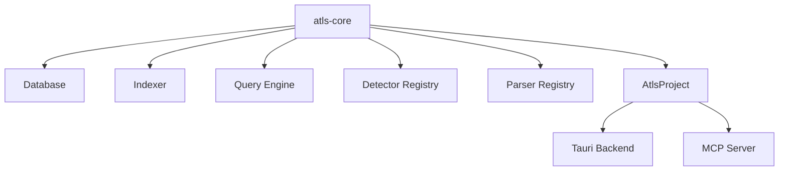

# ATLS Engine

## What It Is

The ATLS engine is the reusable Rust code-intelligence layer centered on `atls-rs/crates/atls-core`. It provides project indexing, parsing, querying, detector loading, and related project services that higher-level hosts can embed.

In this repository, the main host is the Tauri desktop backend, and the secondary host is the MCP server.

## Why It Exists

ATLS Studio needs a language-aware backend that can:

- scan and index codebases
- persist analysis data in SQLite
- answer structural and search queries
- load issue-detection patterns
- watch for file changes

Those capabilities should be reusable across multiple hosts instead of being tied only to the desktop app. `atls-core` is that shared engine boundary.

## Main Responsibilities

- Manage the project database and schema.
- Build and update indexes over source files.
- Parse code through parser registries and language integrations.
- Run queries for search, symbols, issues, files, and context.
- Load detector patterns and expose higher-level project services through `AtlsProject`.

## Key Code Locations

- `atls-rs/crates/atls-core/src/lib.rs`: top-level module exports.
- `atls-rs/crates/atls-core/src/project.rs`: `AtlsProject` wrapper that wires the engine components together.
- `atls-rs/crates/atls-core/src/db/`: database layer and migrations.
- `atls-rs/crates/atls-core/src/indexer/`: indexing and scan logic.
- `atls-rs/crates/atls-core/src/query/`: query engine and query surfaces.
- `atls-rs/crates/atls-core/src/detector/`: detector registry and pattern loading.
- `atls-rs/crates/atls-core/src/parser/`: parser registry.
- `atls-rs/crates/atls-core/src/watcher/`: file watching support.
- `atls-rs/crates/atls-core/src/preprocess/`: preprocessing support for indexed inputs.

## Engine Structure

`atls-core` exposes a small set of foundational modules:

- `db`: SQLite storage and schema management.
- `indexer`: scan and indexing services.
- `query`: read-side search and lookup behavior.
- `detector`: issue and pattern detection support.
- `parser`: parser registry and language integration points.
- `watcher`: file-watch integration.
- `project`: high-level wrapper that assembles the engine for a root path.

`AtlsProject` acts as the compositional entry point. It owns the project root, database handle, indexer, query engine, detector registry, and parser registry.

## Current Host Relationship

The engine is intentionally lower-level than the desktop app. Hosts are responsible for adapting it to their own transport or UX needs:

- `Tauri Backend`: wraps engine operations in desktop-native commands for the Studio app.
- `ATLS MCP Server`: exposes engine-backed operations as MCP tools for external clients.

## Storage And Project Initialization

The `AtlsProject` wrapper creates a project-local `.atls` directory, opens the engine database, looks for detector patterns, and wires together the indexer and query engine for a specific root path.

That root-scoped project abstraction is what lets different hosts reuse the same engine behavior against the same codebase.

## How It Connects To Other Subsystems

- `Tauri Backend`: the desktop app reaches the engine through Rust backend modules.
- `MCP Integration`: the MCP server uses the same underlying engine concepts to answer tool calls.
- `Freshness And Hash Protocol`: the runtime docs describe the higher-level memory model, while the engine supplies the code-intelligence and project-analysis capabilities underneath it.

## Related Documents

- `ARCHITECTURE.md`
- `docs/tauri-backend.md`
- `docs/mcp-integration.md`
- `docs/batch-executor.md`
