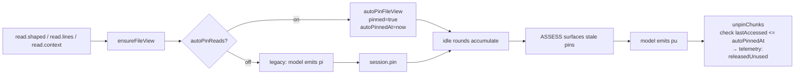

# Auto-Pin on Read

**Auto-pin on read** flips the default retention contract: reads (`rs`, `rl`, `rc`, `rf`) auto-pin their resulting FileView. The model's retention vocabulary collapses to release-only (`pu` / `pc` / `dro`), with explicit `pi` kept for non-read artifacts (searches, analyses) or shape overrides.

Source: read handlers in [atls-studio/src/services/batch/handlers/context.ts](../atls-studio/src/services/batch/handlers/context.ts); store method `autoPinFileView` in [atls-studio/src/stores/contextStore.ts](../atls-studio/src/stores/contextStore.ts); telemetry in [atls-studio/src/services/autoPinTelemetry.ts](../atls-studio/src/services/autoPinTelemetry.ts); protocol cached in [atls-studio/src/prompts/cognitiveCore.ts](../atls-studio/src/prompts/cognitiveCore.ts); settings flag `autoPinReads` in [atls-studio/src/stores/appStore.ts](../atls-studio/src/stores/appStore.ts).

## Why this exists

Every explicit `pi` the model emitted paid output tokens (~25 per step) on a decision the runtime can make better than the model — "yes, keep what I just read" is the common case. Under 5x output pricing, 5 pins per exploration round costs ~600 effective input-equivalent tokens. Over 20 rounds, ~12k effective tokens went to a constant.

Retention-op compaction (see [history-compression.md](history-compression.md#retention-op-compaction-ephemeral-output)) already made explicit retention free in persisted history — retention tool_use args are stripped and OK result lines are removed entirely (the manifest carries the effect). The cost that remained was **per-emission output on the assistant's turn**. Auto-pin eliminates it for read-derived FileViews while keeping the decision anchor ASSESS needs — the "release" side — fully under the model's control.

## Flow



## What auto-pins

| Op | Auto-pin? | Notes |
|---|---|---|
| `read.shaped` (`rs`) | Yes, all shapes | sig / fold / grep / etc. Ranking self-regulates — sig chunks are small, score low on ASSESS, release in bulk. |
| `read.lines` (`rl`) | Yes | Creates the FileView if missing (previously only looked up). |
| `read.context` (`rc`) full/raw | Yes | Heavyweight reads; always retention-intent. |
| `session.load` (`rf`) | Yes | Explicit load still triggers auto-pin via the shared `ensureFileView` path. |

## What does NOT auto-pin

- `search.*` — aggregate results, rarely the retention target. The model can still `pi` a specific search ref when wanted.
- `verify.*` — transient diagnostics. Pin explicitly if you need to revisit output.
- `session.bb.write` — durable by contract, no pin needed.
- Subagent-delegated artifacts — have their own scoped retention lifecycle.
- Tree reads (`rc type:tree`) — directory listings, no file content to retain.
- Engram reads (`rl` on a non-file `h:`) — the slice targets an in-memory chunk, not a file.

## Store contract

New method on `ContextStore`:

```typescript
autoPinFileView(path: string, shape?: string): boolean
```

- Returns `true` on first-time auto-pin; `false` if the view is already pinned (manual or auto) or does not exist.
- Sets `pinned = true`, `pinnedShape = shape`, `autoPinnedAt = Date.now()`.
- Does **not** advance `lastAccessed` — that's the read's job. The invariant `lastAccessed <= autoPinnedAt` at unpin time is the signal for "never re-accessed after pin."
- Idempotent: a second read that triggers auto-pin is a no-op, preserves the original `autoPinnedAt`.

New field on `FileView`:

```typescript
autoPinnedAt?: number;
```

Wall-clock marker set by `autoPinFileView`. Cleared by `unpinChunks` and `setFileViewPinned(..., false)`.

## Telemetry

Two counters accumulate per round and drain once in `captureInternalsSnapshot`:

- **`autoPinsCreated`** — count of successful auto-pin events (one per first-time pin of a file in this round).
- **`autoPinsReleasedUnused`** — count of auto-pinned views released with `lastAccessed <= autoPinnedAt` (never re-accessed after the initial read that auto-pinned them).

Both land on `RoundSnapshot` alongside existing ASSESS / retention-op counters.

**Unused-pin rate = `autoPinsReleasedUnused / autoPinsCreated`** is the primary ship-gate signal. The interpretation:

- < 30% — auto-pin is pulling its weight; most pinned files get re-read or edited before release.
- 30-50% — borderline. Probably fine for exploration-heavy sessions (many sig scans), might want to narrow to non-sig reads only.
- \> 50% — too aggressive. Consider restricting to `rl`/`rc` or to reads outside the active task-plan scope.

## Interaction with other subsystems

| Subsystem | Relationship |
|---|---|
| **ASSESS** | Ranks `tokens × (idleRounds + 2 × survivedEditsWhileIdle)` — pin-source-agnostic. Auto-pin *improves* the signal by surfacing ALL reads to ASSESS's ranking rather than only the ones the model pre-judged as keepers. A view auto-pinned, edit-forwarded N times, never re-accessed, is a perfect release candidate (the signal sharpens, doesn't degrade). |
| **Retention-op compaction** | Auto-pin means the model rarely emits `pi`, so there's less retention output to strip. When the model does emit retention calls (explicit `pi` on a non-read artifact, or `pu`/`pc`/`dro` release), compaction removes the OK result line entirely from persisted history and strips args from the tool_use — the manifest is the receipt. |
| **Spin detection** | Adds a new template spin signature: emitting `pi` on a FileView ref that's already auto-pinned. The anti-pattern lives in cognitive core; the detector catches repeat offenders. |
| **FileView render** | No change. Auto-pin writes to the same `pinned` flag any other path uses — the view renders identically regardless of pin source. |
| **Session persistence** | `autoPinnedAt` persists with the FileView in snapshots. On restore, the unused-pin detection continues working correctly across sessions. |

## Cached protocol (BP-static)

The cognitive core paragraph replaces the prior pin-discipline block:

> Two retention tiers. One hash per file, one pin per file:
>  - **pin** (auto on reads): rs/rl/rc/rf auto-pin their FileView — `h:<short>` is the single retention identity per file (shared `h:<short>` namespace with chunks), retained across rounds whether you read a sig, sliced ranges, or loaded the full body. Your retention vocabulary is release-only: **pu** unpin when done with a target, **pc** compact to shrink, **dro** drop to delete. ASSESS surfaces stale pins for release automatically. Explicit **pi** stays available for non-read artifacts (searches, analyses) you want to persist.
>  - **bw**: durable findings that survive compaction, eviction, and session boundaries.

Net cached-token delta: **~106 tokens saved** on `COGNITIVE_CORE_BODY` (2747 → 2641 on the BPE counter), plus removal of 3 anti-patterns that no longer apply.

## Settings flag

`Settings.autoPinReads?: boolean` (default `true`). UI toggle in the Settings panel alongside `compressToolResults`.

This is an **emergency rollback lever, not a comparison mechanism**. The cognitive core prompt is written assuming auto-pin; turning the flag off leaves the prompt telling the model "reads auto-pin" while the runtime no longer does. There's no parallel-session A/B — you can only observe one world at a time, and the shipped world is auto-pin on. The flag exists so we can disable auto-pin without a release if a serious regression emerges.

## Measurement gate

Per [atls-pillars.mdc](../.cursor/rules/atls-pillars.mdc), two kinds of gates — a **static** one verified at build time, and **observational** ones read from production telemetry after ship.

**Static (build-time, already passing):**

- **Cognitive core cached tokens** — verified: 2747 → 2641 tokens on `countTokensSync(COGNITIVE_CORE_BODY)`. Net −106 tokens + 3 anti-patterns removed.
- **Handler coverage** — 9 unit tests in [context.autopin.test.ts](../atls-studio/src/services/batch/handlers/context.autopin.test.ts) confirm all three read paths auto-pin, flag OFF disables, second-read is idempotent, explicit `pi` on an auto-pinned view doesn't double-count, and the unused-pin telemetry fires only when `lastAccessed <= autoPinnedAt`.
- **ASSESS compatibility** — [assessContext.test.ts](../atls-studio/src/services/assessContext.test.ts) confirms auto-pinned views rank identically to manually-pinned views of the same size/age.
- **Cache stability** — no change to history shape; invariant is covered by the existing retention-op compaction tests.

**Observational (post-ship, read from `RoundSnapshot`):**

- **Unused-pin rate** — `autoPinsReleasedUnused / autoPinsCreated` over the first 10 real sessions. Gate: < 30%. Above that, the default is too aggressive and we narrow scope (exclude sig reads, or only auto-pin out-of-scope views). Tracked per-round on the snapshot, summarized in Internals.
- **ASSESS fire rate** — tracked via the existing `assessFired` flag. Gate: no more than 2x the pre-auto-pin baseline per session of similar length.
- **Output pin emission** — because explicit `pi` becomes rare under auto-pin, total `session.pin` invocations per session should fall sharply. Read from telemetry as a sanity check, not a hard gate.

Ship criterion is satisfied today on the static half; the observational half reads itself as sessions run.

## Out of scope (v1)

- Auto-pin for `search.*` / `verify.*` results — data-dependent, revisit after measuring read auto-pin in production.
- Runtime auto-release heuristics — the point of this plan is the model owns release; adding runtime autonomy conflicts with that.
- Removing explicit `session.pin` from the tool surface — keep as override; revisit after unused-pin rate stabilizes.
- Subagent auto-pin — subagents have scoped retention; defer until main-loop data is in.
