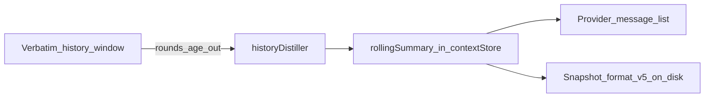

# History Compression

As conversations grow through multi-round tool loops, tool results and long messages accumulate in the message history. Without compression, the history can consume the entire context budget. ATLS compresses history by replacing content with hash references, keeping the knowledge accessible without the token cost.

## How It Works

### Hash-Reference Deflation

Large tool results in conversation history are replaced with compact hash pointers:

```
Before (inline in history):
  [2000-token search result with full code snippets]

After (compressed):
  [-> h:a1b2c3, 2000tk | search results for "auth"]
  fn authenticate:15-32 | cls AuthService:34-89
```

The original content remains in working memory (as an engram) or archive. The model can recall it by hash reference at any time. The history entry now costs ~20 tokens instead of ~2000.

### Compression Thresholds

| Content Type | Threshold | Compressed When |
|-------------|-----------|-----------------|
| Tool results | 500 tokens | Content exceeds threshold |
| Exec/verify/git results | 800 tokens | Higher threshold for structured output |
| Tool use inputs (JSON) | 500 tokens | Large tool call parameters |
| Long text messages | 350 tokens | Non-tool text blocks |

## Two Compression Paths

### 1. `compressToolLoopHistory` (Between Turns)

Runs via the history compression middleware on round 0 (between user turns). This is the primary compression path.

**Rules**:
- Protects recent rounds (last N rounds are never compressed)
- Never touches messages before `priorTurnBoundary` (preserves BP3 cache prefix)
- Each compressed block is registered in working memory via `addChunk`
- HPP `dematerialize()` is called for compressed chunks (transitions materialized → referenced)

**Budget-driven compression**: If history exceeds `CONVERSATION_HISTORY_BUDGET_TOKENS` (12k), the oldest non-reference messages are compressed until under budget.

### 2. `deflateToolResults` (Immediately After Tools)

Runs right after tool execution completes, before the next round. This is a lighter pass:

- No token threshold — always runs
- Does **not** create new chunks
- Replaces tool result content with hash references **only when a matching engram already exists** in working memory (matched by content hash or source description)
- Prevents duplicate content between history and working memory

## Rolling history window

Beyond hash deflation, the compressor maintains a **verbatim window** of the most recent tool-loop rounds in history. Constants live in [`promptMemory.ts`](../atls-studio/src/services/promptMemory.ts): `ROLLING_WINDOW_ROUNDS` (10) and `ROLLING_SUMMARY_MAX_TOKENS` (500).

When the number of **rounds** in history exceeds the window, the **oldest** round is removed from the verbatim transcript and **distilled** into structured facts by [`historyDistiller.ts`](../atls-studio/src/services/historyDistiller.ts). The distiller fills a [`RollingSummary`](../atls-studio/src/services/historyDistiller.ts) in the context store (`decisions`, `filesChanged`, `userPreferences`, `workDone`, `findings`, `errors`).

### API-only rolling summary message

The distilled summary is **not** appended as a normal chat UI message. When building the provider request, [`aiService.ts`](../atls-studio/src/services/aiService.ts) **prepends** a synthetic assistant message whose body starts with the marker `[Rolling Summary]` (see `formatSummaryMessage` / `ROLLING_SUMMARY_MARKER` in the distiller). That message exists only in the **in-memory history** sent to the API. The visible transcript stays append-only for user/assistant turns; BP3 still treats the history prefix as stable for caching **within** a tool loop (see [Prompt Assembly](./prompt-assembly.md) for synthetic prefix vs UI transcript).

### Interaction with compression

- The rolling summary message is **not** compressed into a hash pointer (`[-> h:…]`), so distilled facts are not replaced by stale pointers.
- When compressed history would leave **orphaned** hash pointers that referenced the rolling summary, those pointers are **removed** to avoid incoherent references.



Distilled state is persisted with the memory snapshot as **snapshot format v5** (`rollingSummary` on [`PersistedMemorySnapshot`](../atls-studio/src/services/chatDb.ts)); see [session-persistence.md](./session-persistence.md).

## Digest Format

Compressed entries include an edit-ready digest when available:

```typescript
function formatChunkRef(shortHash, tokens, source?, description?, digest?): string {
  const header = description
    ? `[-> h:${shortHash}, ${tokens}tk | ${description}]`
    : `[-> h:${shortHash}, ${tokens}tk${source ? ` ${source}` : ''}]`;
  if (digest) return `${header}\n${digest}`;
  return header;
}
```

The digest provides structural context — function names, line ranges, class declarations — so the model can decide whether to recall the full content without spending tokens to see it.

## Cache Interaction

History compression is deliberately deferred to round 0 to maintain cache stability:

- **Within a tool loop** (rounds 1, 2, 3...): The **saved chat transcript** is strictly append-only. No compression, no mutation of prior messages. This ensures the BP3 cache prefix stays byte-identical for that transcript, giving cache reads at 0.1x cost. The API may still **prepend** the synthetic `[Rolling Summary]` message (see above); logical BP3 hit/miss is modeled in [`logicalCacheMetrics.ts`](../atls-studio/src/services/logicalCacheMetrics.ts) — see [prompt-assembly.md](./prompt-assembly.md).
- **Between user turns** (round 0): Compression runs, potentially modifying old messages. This invalidates the BP3 cache, but a new cache write happens at the start of the next tool loop.

## Context Hygiene Middleware

After 20+ rounds, the context hygiene middleware performs aggressive compression:

- Threshold: `COMPACT_HISTORY_TOKEN_THRESHOLD` (15k tokens)
- Trigger: `roundCount >= COMPACT_HISTORY_TURN_THRESHOLD` (20 rounds)
- Action: Same as `compressToolLoopHistory` but runs at any round, not just round 0

This is a safety net for extremely long sessions where the model hasn't called `compact_history` itself.

## Model-Initiated Compression

The model can explicitly trigger compression via `session.compact_history`:

```json
{"id": "ch", "use": "session.compact_history"}
```

The Cognitive Core prompt advises: "Call when `history_tokens > 15k` or round count > 20 (whichever first)."

---

**Source**: [`historyCompressor.ts`](../atls-studio/src/services/historyCompressor.ts), [`historyDistiller.ts`](../atls-studio/src/services/historyDistiller.ts), [`chatMiddleware.ts`](../atls-studio/src/services/chatMiddleware.ts), [`contextHash.ts`](../atls-studio/src/utils/contextHash.ts) (`formatChunkRef`)
