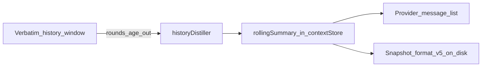

# History Compression

As conversations grow through multi-round tool loops, tool results and long messages accumulate in the message history. Without compression, the history can consume the entire context budget. ATLS compresses history by replacing content with hash references, keeping the knowledge accessible without the token cost.

## How It Works

### Hash-Reference Deflation

Large tool results in conversation history are replaced with compact hash pointers:

```
Before (inline in history):
  [2000-token search result with full code snippets]

After (compressed):
  [h:a1b2c3 2000tk search results for "auth"]
  fn authenticate:15-32 | cls AuthService:34-89
```

The original content remains in working memory (as an engram) or archive. The model can recall it by hash reference at any time. The history entry now costs ~20 tokens instead of ~2000.

The wire format is **`[h:SHORT TOKENStk DESCRIPTION]`** — no arrow, no comma. The `->` and `,` were dropped because BPE tokenizers (Claude, OpenAI) encode them as punctuation-heavy sequences; spaces between fields tokenize more efficiently. See `formatChunkRef` in [`contextHash.ts`](../atls-studio/src/utils/contextHash.ts) ~155-177.

| Content Type | Threshold | Source |
|-------------|-----------|--------|
| Tool results (general) | **100 tokens** (`COMPRESSION_THRESHOLD_TOKENS`) | [`historyCompressor.ts`](../atls-studio/src/services/historyCompressor.ts) ~44 |
| `system.*` / `verify.*` results | **200 tokens** (`HIGHER_THRESHOLD` via `TOOL_COMPRESSION_OVERRIDES`) | [`historyCompressor.ts`](../atls-studio/src/services/historyCompressor.ts) ~50-57 |
| Tool text replacement in history | **100 tokens** (`HISTORY_TEXT_REPLACEMENT_THRESHOLD_TOKENS`) | same file ~59 |
| Batch `tool_use` input (assistant side) | **80 tokens** (`BATCH_INPUT_STUB_THRESHOLD`) | [`historyCompressor.ts`](../atls-studio/src/services/historyCompressor.ts) `stubBatchToolUseInputs` |
| Match-aware dynamic floor | **`floor(base * 0.6)`** when a matching engram already exists | [`historyCompressor.ts`](../atls-studio/src/services/historyCompressor.ts) ~470-479 |

The low base threshold is deliberate: the model gets **one round** to see a full result inline, then it deflates. This keeps the rolling transcript small without hiding fresh output.

## Two Compression Paths

### 1. `compressToolLoopHistory` (Between Turns)

Runs via the history compression middleware on round 0 (between user turns). This is the primary compression path.

**Rules**:
- Protects recent rounds (last N rounds are never compressed)
- Never touches messages before `priorTurnBoundary` (preserves BP3 cache prefix)
- Each compressed block is registered in working memory via `addChunk`
- HPP `dematerialize()` is called for compressed chunks (transitions materialized → referenced)
**Budget-driven compression**: If history exceeds `CONVERSATION_HISTORY_BUDGET_TOKENS` (24k), the oldest non-reference messages are compressed until under budget.

### 2. `deflateToolResults` (Immediately After Tools)

Runs right after tool execution completes, before the next round. A lighter pass than the between-turns compressor, but it **does create chunks** for results large enough to be worth pointing at:

- First, tries to match the tool_result against an existing engram (by content hash or source description) and replaces inline content with a hash pointer.
- When **no match exists** and the tool_result is **≥ 30 tokens** (`MIN_DEFLATE_TOKENS` in [`historyCompressor.ts`](../atls-studio/src/services/historyCompressor.ts) ~722), a new engram is created via `addChunk` and the history entry is replaced with a ref to it. History never carries large inline tool results — they're always written at insertion time.
- **Revision guard**: skips deflating onto engrams whose backing file revision no longer matches the current source (avoids pointing history at stale WM).
- **Assistant side**: `stubBatchToolUseInputs` runs on the latest assistant message and replaces large `tool_use.input.steps` arrays (> 80 tokens of serialized form) with a compact `_stubbed` summary — see below.
## Rolling history window

Beyond hash deflation, the compressor maintains a **verbatim window** of the most recent tool-loop rounds in history. Constants live in [`promptMemory.ts`](../atls-studio/src/services/promptMemory.ts): `ROLLING_WINDOW_ROUNDS` (20) and `ROLLING_SUMMARY_MAX_TOKENS` (1650).

When the number of **rounds** in history exceeds the window, the **oldest** round is removed from the verbatim transcript and **distilled** into structured facts by [`historyDistiller.ts`](../atls-studio/src/services/historyDistiller.ts). The distiller fills a [`RollingSummary`](../atls-studio/src/services/historyDistiller.ts) in the context store (`decisions`, `filesChanged`, `userPreferences`, `workDone`, `findings`, `errors`).

**Substantive round counting.** `countSubstantiveRounds` in [`historyCompressor.ts`](../atls-studio/src/services/historyCompressor.ts) ~107 excludes rounds triggered by synthetic auto-continue prompts (e.g. "Your response was truncated", "Continue working.") from the window count, so system-injected continuations don't push real work out of the verbatim transcript.

### Rolling summary in the state preamble

The distilled summary is **not** appended as a normal chat UI message. When building the provider request, [`aiService.ts`](../atls-studio/src/services/aiService.ts) includes the rolling summary as part of the **state preamble** — a synthetic first user message in the assembled payload that also carries session state (task/plan, BB, WM, steering signals). The summary is merged into this preamble via `conversationHistory.unshift(formatSummaryMessage(...))` and then combined with the state block by `assembleProviderMessages()`. The visible transcript stays append-only for user/assistant turns; BP3 still treats the history prefix as stable for caching **within** a tool loop (see [`prompt-assembly.md`](prompt-assembly.md)).

### Interaction with compression

- The rolling summary message is **not** compressed into a hash pointer, so distilled facts are not replaced by stale pointers. A targeted cleanup path in `compressToolLoopHistory` also removes any orphaned assistant messages that happen to be compressed refs containing `[Rolling Summary]` text ([`historyCompressor.ts`](../atls-studio/src/services/historyCompressor.ts) ~255-275).
- When compressed history would leave **orphaned** hash pointers that referenced the rolling summary, those pointers are **removed** to avoid incoherent references.



Distilled state is persisted with the memory snapshot as **snapshot format v5** (`rollingSummary` on [`PersistedMemorySnapshot`](../atls-studio/src/services/chatDb.ts)).

## Digest Format

Compressed entries include an edit-ready digest when available:

```typescript
function formatChunkRef(shortHash, tokens, source?, description?, digest?): string {
  const header = description
    ? `[h:${shortHash} ${tokens}tk ${description}]`
    : `[h:${shortHash} ${tokens}tk${source ? ` ${source}` : ''}]`;
  if (digest) return `${header}\n${digest}`;
  return header;
}
```

The digest provides structural context — function names, line ranges, class declarations — so the model can decide whether to recall the full content without spending tokens to see it.

## Cache Interaction

History compression is deliberately deferred to round 0 to maintain cache stability:

- **Within a tool loop** (rounds 1, 2, 3...): The **saved chat transcript** is strictly append-only. No compression, no mutation of prior messages. This ensures the BP3 cache prefix stays byte-identical for that transcript, giving cache reads at 0.1x cost. The API may still **prepend** the synthetic `[Rolling Summary]` message (see above); logical BP3 hit/miss is modeled in [`logicalCacheMetrics.ts`](../atls-studio/src/services/logicalCacheMetrics.ts) — see [`prompt-assembly.md`](prompt-assembly.md).
- **Between user turns** (round 0): Compression runs, potentially modifying old messages. This invalidates the BP3 cache, but a new cache write happens at the start of the next tool loop.

## Stubbing assistant-side batch tool_use

Compression traditionally targets tool *results* (the user-role messages). `stubBatchToolUseInputs` in [`historyCompressor.ts`](../atls-studio/src/services/historyCompressor.ts) ~669 attacks the **assistant** side:

- Scans the most recent assistant message for `tool_use` blocks with `name === 'batch'`.
- If the serialized `input` exceeds `BATCH_INPUT_STUB_THRESHOLD = 80` tokens, replaces `input.steps` with a compact `_stubbed` summary produced by `formatBatchToolUseStubSummary`.
- Called from [`aiService.ts`](../atls-studio/src/services/aiService.ts) immediately after the assistant message is pushed, **before** `deflateToolResults` processes the paired tool_result blocks.

This matters because a large `batch` payload (say, 20 steps with inline content) can dominate the transcript the next round will re-read. After stubbing, the model sees the shape of what it did without re-reading the full step list.

## Retention-op compaction

`compactRetentionOps` in [`historyCompressor.ts`](../atls-studio/src/services/historyCompressor.ts) runs **between** `stubBatchToolUseInputs` and `deflateToolResults` at turn-finalize. It strips ghost-ref surface from state-mutation calls whose effect is already captured in the current hash manifest:

| Retention op | `tool_use` args after compaction | `tool_result` line after compaction |
|---|---|---|
| `session.pin`, `session.unpin` | `{n:N}` (count of hashes) | `[OK] <id> (session.pin): ok` |
| `session.drop`, `session.unload` | `{n:N}` (scope-based drops unchanged) | `[OK] <id> (session.drop): ok` |
| `session.compact` | `{n:N}` | `[OK] <id> (session.compact): ok` |
| `session.bb.delete` | `{n:N}` (count of keys) | `[OK] <id> (session.bb.delete): ok` |

**Rules:**
- Only `[OK]` per-step lines are compacted. `[FAIL]` lines are preserved verbatim — their error text carries debuggable signal (e.g. `step 'r1' produced no h:refs`).
- Non-retention ops (`read.*`, `search.*`, `session.bb.write`, `change.*`, `verify.*`, `task_complete`, …) are untouched. `deflateToolResults` handles their payloads.
- Scope-based drops with no specific refs (`{scope:'archived', max:25}`) skip — no ghost surface to strip.
- `step.in` dataflow references are also dropped (they resolve to prior-step refs, same ghost vector).
- Idempotent via `_compacted: true` marker on each step; second run is a no-op.
- Runs **pre-BP3** so the compacted form is what lands in the cacheable prefix — no retroactive rewrite.

**Why:** sub-threshold retention batches (often 2–5 steps) stay under the 80-token stub threshold and otherwise survive verbatim for the full rolling window. The literal hashes in the tool_use and the "unpinned 3 chunks (19ms)" tails in the tool_result become a template the model re-emits next round, pointing at hashes that are already gone from the manifest — the template-calcification spin pattern. Compacting these leaves the narrative action (`session.unpin: ok`) visible but the refs unreachable.

## Emergency compression

`compressToolLoopHistory` accepts an optional `emergency` flag. When set, it compresses **even protected rounds** — normally the last N rounds are preserved verbatim, but under pressure the safety net is lowered. Used by `chatMiddleware` when token pressure crosses hard caps mid-loop.

## Context Hygiene Middleware

After 20+ rounds, the context hygiene middleware performs aggressive compression:

- Threshold: `COMPACT_HISTORY_TOKEN_THRESHOLD = 18000` tokens
- Trigger: `roundCount >= COMPACT_HISTORY_TURN_THRESHOLD = 20` rounds
- Action: Same as `compressToolLoopHistory` but runs at any round, not just round 0

Both constants live in [`promptMemory.ts`](../atls-studio/src/services/promptMemory.ts) ~36-37. This is a safety net for extremely long sessions where the model hasn't called `session.compact_history` itself.

## Model-Initiated Compression

The model can explicitly trigger compression via `session.compact_history`:

```json
{"id": "ch", "use": "session.compact_history"}
```

The tool reference surfaces the `ch` shorthand; the Cognitive Core doesn't carry a specific threshold quote — the model is expected to call it when it observes sustained history growth (typically past the hygiene threshold above).

---

**Source**: [`historyCompressor.ts`](../atls-studio/src/services/historyCompressor.ts), [`historyDistiller.ts`](../atls-studio/src/services/historyDistiller.ts), [`chatMiddleware.ts`](../atls-studio/src/services/chatMiddleware.ts), [`contextHash.ts`](../atls-studio/src/utils/contextHash.ts) (`formatChunkRef`), [`promptMemory.ts`](../atls-studio/src/services/promptMemory.ts) (thresholds)
