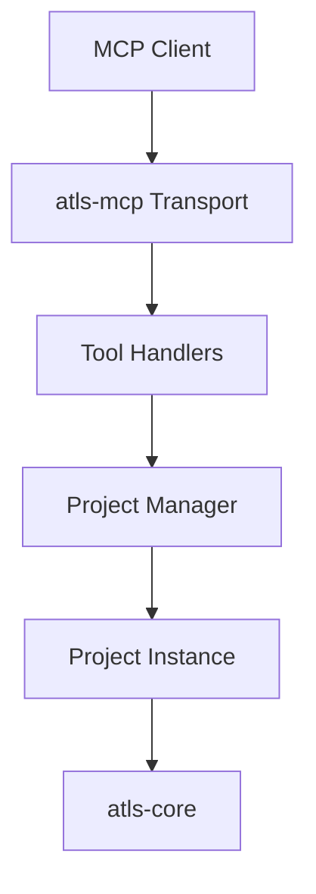

# MCP Integration

## What It Is

MCP integration is the subsystem that exposes ATLS capabilities to external MCP clients through the `atls-rs/crates/atls-mcp` server. It packages core engine features behind a transport and tool schema that other agent environments can call.

This is the repo's external ATLS interface, separate from the Studio desktop app.

## Why It Exists

ATLS is useful outside the Studio UI. MCP integration makes the engine available to tools and agent hosts that want ATLS-backed search, scanning, issue discovery, overview generation, export, and batch execution without embedding the full desktop application.

## Main Responsibilities

- Start an MCP-compatible server process.
- Expose a defined tool surface for external clients.
- Create or reuse root-scoped project instances for requests.
- Route tool calls into engine-backed handlers.
- Provide a transport boundary that is independent from Tauri or the Studio UI.

## Key Code Locations

- `atls-rs/crates/atls-mcp/src/main.rs`: process entry point.
- `atls-rs/crates/atls-mcp/src/transport.rs`: server transport handling.
- `atls-rs/crates/atls-mcp/src/protocol.rs`: protocol shapes.
- `atls-rs/crates/atls-mcp/src/handlers/mod.rs`: tool list, schemas, and dispatch.
- `atls-rs/crates/atls-mcp/src/project.rs`: project and project-manager layer used by MCP requests.

## Exposed Tool Surface

The MCP server currently organizes external access around a small set of tool families:

- `batch_query`
- `batch`
- `find_issues`
- `scan_project`
- `get_codebase_overview`
- `get_patterns`
- `export`

These tools give external clients a stable, transport-friendly surface over the underlying ATLS engine behaviors.

## Project Management Model

The MCP server keeps a `ProjectManager` that caches project instances by canonical root path. A request can target a specific root, and the server will either reuse an existing project or open a new one for that root.

This avoids rebuilding the full project layer for every tool call while still keeping work scoped to a codebase.

## Boundary With Studio

The Studio app does not need the MCP server to function. Studio talks to Rust through Tauri. The MCP server exists so external clients can reach ATLS through a separate protocol boundary.

That means there are two host layers in the repository:

- `Studio host`: Tauri plus the React UI.
- `External host`: MCP server plus tool handlers.

Both depend on the shared Rust engine, but they are different entry points with different transport contracts.

## Current Storage Note

The current MCP project wrapper opens its database at `.atls/db.sqlite`, while `atls-core`'s `AtlsProject` wrapper opens `.atls/atls.db`. This is an implementation boundary worth knowing when reasoning about how Studio-hosted and MCP-hosted work may persist project state.

## How It Connects To Other Subsystems

- `ATLS Engine`: MCP handlers reuse engine concepts such as indexing, querying, detector loading, and project management.
- `Tauri Backend`: both are Rust hosts over ATLS capabilities, but Tauri is app-facing while MCP is protocol-facing.
- `Batch Executor`: the MCP `batch` and `batch_query` tools expose related concepts to external clients.

## Related Documents

- `ARCHITECTURE.md`
- `docs/atls-engine.md`
- `docs/tauri-backend.md`
- `docs/batch-executor.md`
