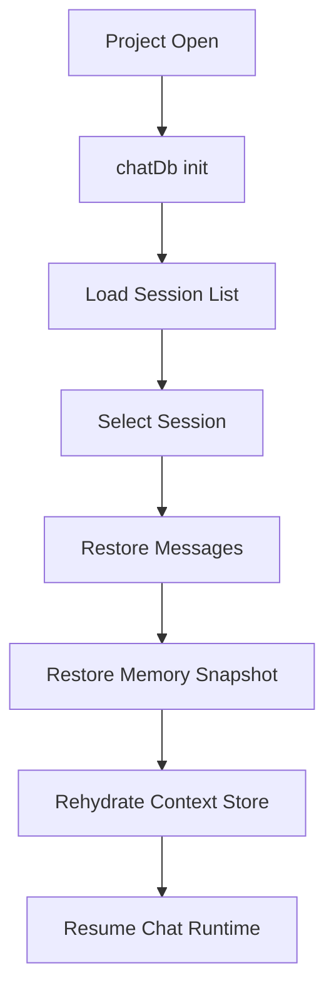

# Session Persistence

## What It Is

Session persistence is the subsystem that saves and restores chat sessions, message history, working memory state, blackboard data, swarm task state, archived chunks, staged snippets, and related session metadata.

In practice, this is the bridge between the live frontend stores and the per-project SQLite storage managed through Tauri.

## Why It Exists

ATLS sessions are more than a plain transcript. A useful restore point needs to bring back:

- the visible chat
- tool-call segmentation
- blackboard knowledge
- archived and staged memory
- task plans and transition metadata
- swarm task state
- hash stacks and other runtime bookkeeping

Without a persistence layer, the runtime would lose continuity whenever the app closed, the project changed, or the user switched sessions.

## Main Responsibilities

- Initialize a per-project chat database when a project opens.
- Persist sessions, messages, tool segments, and session titles.
- Save and restore blackboard entries and notes.
- Persist full memory snapshots so the context store can be rehydrated.
- Store swarm tasks, agent stats, archived chunks, staged snippets, and hash registry entries.
- Support restore points for edit-and-resend flows.

## Key Code Locations

- `atls-studio/src/services/chatDb.ts`: frontend-side persistence service that wraps Tauri `chat_db_*` commands.
- `atls-studio/src/hooks/useChatPersistence.ts`: lifecycle hook that initializes the database, autosaves sessions, loads sessions, restores snapshots, and handles project switching.
- `atls-studio/src-tauri/src/chat_db.rs`: Rust-side database implementation.
- `atls-studio/src-tauri/src/chat_db_commands.rs`: Tauri command surface for persistence operations.

## Persistence Model

The persistence layer stores several kinds of session state:

- `Sessions`: the top-level chat or swarm records for a project.
- `Messages And Segments`: visible messages plus segmented tool-call structure.
- `Blackboard Data`: persistent session knowledge and reserved metadata notes.
- `Memory Snapshots`: serialized runtime state for rehydrating the context store.
- `Archived Chunks And Staged Snippets`: memory regions that should survive across app restarts.
- `Swarm Tasks And Agent Stats`: task execution records for swarm sessions.
- `Session State And Hash Registry`: keyed metadata and hash bookkeeping used by the runtime.

## Restore Flow

When a session is loaded, persistence restores more than just messages:

1. The selected session and message list are loaded.
2. The app store is updated with session metadata and context usage.
3. The context store is reset to avoid leaking prior session state.
4. A saved memory snapshot is restored when available.
5. If no full snapshot exists, the system falls back to partial restoration from blackboard notes, archived chunks, staged snippets, and session-state keys.

This fallback path matters because it lets the system recover gracefully from older formats or partial persistence failures.

## Project Scope

Persistence is project-scoped, not global. The UI initializes the chat database against the currently open project path, and project switches trigger a save of the outgoing session before the new project database is opened.

That project scoping is important because memory, hashes, and chat history are only meaningful relative to a specific codebase.

## How It Connects To Other Subsystems

- `Studio App Shell`: session picker, new chat flow, and project switching all start in the UI.
- `Tauri Backend`: all durable writes and reads flow through Tauri commands.
- `Cognitive Runtime`: persistence saves the memory structures that the runtime uses across turns.
- `Swarm And Orchestration`: swarm sessions persist tasks, status, and agent statistics through the same database surface.

## Related Documents

- `ARCHITECTURE.md`
- `docs/studio-app-shell.md`
- `docs/tauri-backend.md`
- `docs/swarm-orchestration.md`
- `docs/engrams.md`
- `docs/prompt-assembly.md`
