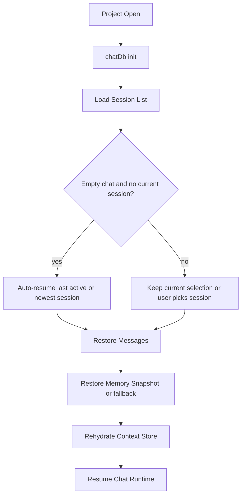

# Session Persistence

## What It Is

Session persistence is the subsystem that saves and restores chat sessions, message history, working memory state, blackboard data, swarm task state, archived chunks, staged snippets, and related session metadata.

In practice, this is the bridge between the live frontend stores and the per-project SQLite storage managed through Tauri.

## Why It Exists

ATLS sessions are more than a plain transcript. A useful restore point needs to bring back:

- the visible chat
- tool-call segmentation
- blackboard knowledge
- archived and staged memory
- task plans and transition metadata
- swarm task state
- hash stacks and other runtime bookkeeping

Without a persistence layer, the runtime would lose continuity whenever the app closed, the project changed, or the user switched sessions.

## Main Responsibilities

- Initialize a per-project chat database when a project opens.
- Persist sessions, messages, tool segments, and session titles.
- Save and restore blackboard entries and notes.
- Persist full memory snapshots so the context store can be rehydrated.
- Store swarm tasks, agent stats, archived chunks, staged snippets, and hash registry entries.
- Support restore points for edit-and-resend flows.
- Remember the **last active session id per project** (localStorage) and **auto-resume** that session after a cold start when the DB loads, if the chat is empty and no session is selected (fallback: most recently updated session).
- On **Tauri** desktop builds, **await a final save** when the window close is requested so debounced or in-flight writes are less likely to be lost (browser `beforeunload` alone is unreliable for async IO).

## Key Code Locations

- `atls-studio/src/services/chatDb.ts`: frontend-side persistence service that wraps Tauri `chat_db_*` commands.
- `atls-studio/src/hooks/useChatPersistence.ts`: lifecycle hook that initializes the database, autosaves sessions, loads sessions, restores snapshots, and handles project switching.
- `atls-studio/src-tauri/src/chat_db.rs`: Rust-side database implementation.
- `atls-studio/src-tauri/src/chat_db_commands.rs`: Tauri command surface for persistence operations.

## Persistence Model

The persistence layer stores several kinds of session state:

- `Sessions`: the top-level chat or swarm records for a project.
- `Messages And Segments`: visible messages plus segmented tool-call structure.
- `Blackboard Data`: persistent session knowledge and reserved metadata notes.
- `Memory Snapshots`: serialized runtime state for rehydrating the context store.
- `Archived Chunks And Staged Snippets`: memory regions that should survive across app restarts.
- `Swarm Tasks And Agent Stats`: task execution records for swarm sessions.
- `Session State And Hash Registry`: keyed metadata and hash bookkeeping used by the runtime.

### Memory snapshot format versions (`PersistedMemorySnapshot`)

Serialized memory state uses a `version` field on [`PersistedMemorySnapshot`](../atls-studio/src/services/chatDb.ts). This is **not** the same as UHPP “v5” in [hash-protocol.md](./hash-protocol.md) (reference syntax).

| Version | Role |
|--------|------|
| **2–3** | Earlier snapshot layouts; still loadable. Core fields: chunks, archive, staged, blackboard, task plan, hash stacks, etc. |
| **4** | Adds session-scoped UI/runtime extras: optional `promptMetrics`, `cacheMetrics`, `roundHistorySnapshots`, `costChat` (see `applyV4SessionExtras` in [`useChatPersistence.ts`](../atls-studio/src/hooks/useChatPersistence.ts)). |
| **5** | Everything in v4 plus optional **`rollingSummary`** — the distilled **rolling history** facts used for the API-only `[Rolling Summary]` message ([history-compression.md](./history-compression.md)). |
| **6** | Current write format. Everything in v5 plus `verifyArtifacts`, `awarenessCache`, `cumulativeCoveragePaths`, `fileReadSpinByPath`, and `fileReadSpinRanges`. All optional — older snapshots load cleanly with empty defaults. |

If a snapshot has no `rollingSummary` (older save) or is below v5, restore clears rolling summary to empty; v4+ extras still apply when `version` is 4, 5, or 6.

### Freshness of persisted verify artifacts

`VerifyArtifact.createdAtRev` records the workspace revision at verification time, but `workspaceRev` is intentionally excluded from snapshots (it is filesystem-bound and stale after restore). After restore, `workspaceRev` resets to 0, so any persisted artifact with `createdAtRev > 0` is correctly flagged as stale by the freshness system. This preserves the verification *history* (the agent knows what was checked) while still forcing re-verification of changed code.

## Restore Flow

When a session is loaded (manually or via auto-resume), persistence restores more than just messages:

1. The selected session and message list are loaded.
2. The app store is updated with session metadata and context usage.
3. The context store is reset to avoid leaking prior session state.
4. A saved memory snapshot is restored when available.
5. If no full snapshot exists, the system falls back to partial restoration from blackboard notes, archived chunks, staged snippets, and session-state keys.

This fallback path matters because it lets the system recover gracefully from older formats or partial persistence failures.

**Auto-resume (cold start):** After `chatDb` initializes for a project, if there is no current session and the message list is empty, the hook loads the session list and picks the **last active session id** for that project path (stored under `atls:last-active-session-by-project-v1` via [`lastActiveSession.ts`](../atls-studio/src/services/lastActiveSession.ts)). If that id is missing or invalid, it falls back to the **newest** session in the list. Users can still switch sessions in the UI afterward.

### Freshness after restore

`loadSession` does **not** run a `read.context` full pass or `refreshRoundEnd` at the end of restore. On **successful memory snapshot restore**, working-memory chunks are marked **`freshness: suspect`** with cause **`session_restore`**, and staged snippets get **`stageState: stale`** (so `canSteerExecution` excludes them until reconciliation). That aligns persisted state with the universal freshness model: nothing from disk is treated as execution-authoritative until the runtime reconciles.

Rehydrated revisions then catch up through **freshness preflight** before a mutation, **`refreshRoundEnd`** after the first `advanceTurn` in a tool loop (`round > 0`), or an **intelligence / scan** refresh. See [freshness.md](./freshness.md) (universal freshness, round-end sweep, preflight).

### Shutdown and save reliability

- **Debounced autosave** runs as messages and context change.
- **`beforeunload`** triggers a best-effort save in web-style environments.
- **Tauri `onCloseRequested`**: the app **awaits** `saveSession` before allowing the window to close, reducing the chance of losing the last transcript or snapshot on exit.

## Project Scope

Persistence is project-scoped, not global. The UI initializes the chat database against the currently open project path, and project switches trigger a save of the outgoing session before the new project database is opened.

That project scoping is important because memory, hashes, and chat history are only meaningful relative to a specific codebase.

## How It Connects To Other Subsystems

- `Studio App Shell`: session picker, new chat flow, and project switching all start in the UI.
- `Tauri Backend`: all durable writes and reads flow through Tauri commands.
- `Cognitive Runtime`: persistence saves the memory structures that the runtime uses across turns.
- `Swarm And Orchestration`: swarm sessions persist tasks, status, and agent statistics through the same database surface.

## Related Documents

- `ARCHITECTURE.md`
- [history-compression.md](./history-compression.md) — rolling window, distilled summary, snapshot format v5
- [freshness.md](./freshness.md) — round-end reconciliation, preflight, timing vs restore
- `docs/studio-app-shell.md`
- `docs/tauri-backend.md`
- `docs/swarm-orchestration.md`
- `docs/engrams.md`
- `docs/prompt-assembly.md`
