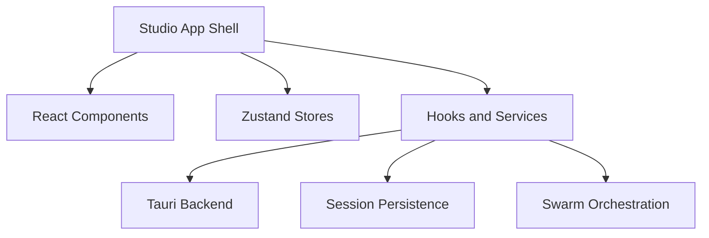

# Studio App Shell

## What It Is

The Studio app shell is the desktop user interface for ATLS Studio. It combines a React/Vite frontend with a Tauri host window to present the code workspace, ATLS intelligence surfaces, and AI chat in a single desktop workflow.

This subsystem is the operator-facing layer of ATLS. It does not implement the cognitive runtime itself; instead, it gives users a place to drive the runtime, inspect project state, and interact with the backend services that power code intelligence and chat.

## Why It Exists

The runtime docs describe how ATLS manages memory, freshness, and prompt assembly, but users still need a practical shell for exploring files, reading and editing code, managing sessions, and running chats or swarm workflows. The Studio app shell provides that desktop control surface.

## Main Responsibilities

- Render the main multi-panel workspace: file explorer, code viewer, ATLS panel, and AI chat.
- Manage shell-level UI state such as active files, panel sizes, theme, quick actions, search, and window controls.
- Route user actions into hooks and services that talk to the Tauri backend.
- Host session selection and swarm-specific views without embedding backend logic directly in the UI.
- Surface prompt metrics in chat (compression savings, freed tokens, cumulative input savings). Compression is driven by [`historyCompressor.ts`](../atls-studio/src/services/historyCompressor.ts) (deflation + stubbing + rolling-window eviction); see [history-compression.md](./history-compression.md). The shell only displays the outputs.
- Offer **Copy context window (last API payload)** in the chat UI ([`AiChat/index.tsx`](../atls-studio/src/components/AiChat/index.tsx)): copies the most recently assembled provider payload JSON for debugging, regression reports, or comparing what the model actually received versus the on-screen transcript.

## Key Code Locations

- `atls-studio/src/App.tsx`: top-level application layout, keyboard shortcuts, modals, panel wiring, and platform-specific window behavior.
- `atls-studio/src/components/`: panel components and UI features such as `FileExplorer`, `CodeViewer`, `AiChat`, `AtlsPanel`, `SearchPanel`, `SessionPicker`, and `SwarmPanel`.
- `atls-studio/src/stores/`: Zustand stores for app state, cost state, swarm state, terminal state, and other shell-level concerns.
- `atls-studio/src/hooks/useAtls.ts`: project open/save/scan behavior and file-system-backed ATLS interactions.
- `atls-studio/src/hooks/useChatPersistence.ts`: session and memory persistence entry point from the UI side.

## Layout Model

The app shell centers around a persistent workspace layout:

- Left: file explorer and project navigation.
- Center: code viewer, or the swarm panel when a swarm session is active.
- Bottom: ATLS intelligence and related lower-panel tooling.
- Right: AI chat, with a collapsible mode during swarm workflows.

This separation matters because the shell keeps UI composition independent from the runtime subsystems underneath it. The same chat and memory runtime can be surfaced through different views without changing the underlying storage or orchestration model.

### ATLS Panel tabs

The ATLS panel ([`AtlsPanel/index.tsx`](../atls-studio/src/components/AtlsPanel/index.tsx)) exposes a set of tabs over the runtime state, each driven from the relevant Zustand store or Tauri command:

| Tab | Content |
|-----|---------|
| **Issues** | Detector findings for the active workspace (from `search.issues` / `find_issues`) |
| **File** (intel) | Per-file intelligence: symbols, imports, dependents, diagnostics |
| **Patterns** | Loaded detector patterns and categories (`get_patterns`) |
| **Overview** | Codebase overview stats and subsystem map (`get_codebase_overview`) |
| **Health** | Project health, scan progress, and index state |

The panel also splits with a terminal pane for `system.exec` output when agent runs need visible shell activity.

## How It Connects To Other Subsystems

- `Tauri Backend`: the shell uses Tauri `invoke()` calls and events to reach native file, search, AI, terminal, and persistence commands.
- `Session Persistence`: the shell triggers session creation, loading, autosave, and restore through the persistence hook.
- `Swarm And Orchestration`: the shell swaps the center panel and session controls when swarm execution is active.
- `Cognitive Runtime`: the UI renders and manipulates the outputs of the runtime, but the runtime logic lives mostly under `src/services/` and `src/stores/`.

## Boundaries

The app shell should own presentation, interaction, and local UI state. It should not become the place where backend policies, database schemas, or orchestration rules are defined. Those responsibilities live in the backend and service layers.

## Related Documents

- [`atls-studio/docs/ARCHITECTURE.md`](../atls-studio/docs/ARCHITECTURE.md)
- [`docs/session-persistence.md`](./session-persistence.md)
- [`docs/swarm-orchestration.md`](./swarm-orchestration.md)
- [`docs/tauri-backend.md`](./tauri-backend.md)
- [`docs/engrams.md`](./engrams.md)
- [`docs/history-compression.md`](./history-compression.md)
