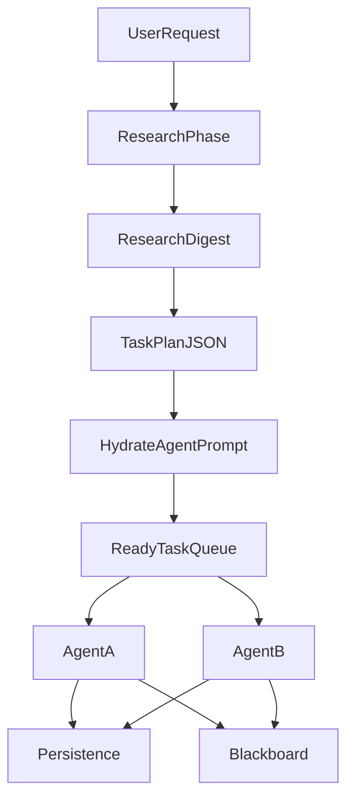
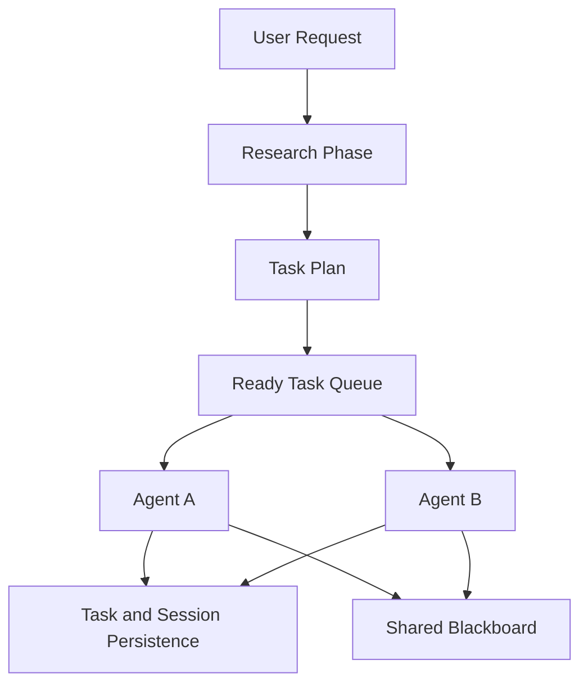

# Swarm And Orchestration

## What It Is

Swarm orchestration is the subsystem that turns a single user request into a coordinated multi-agent workflow. It handles research, planning, task decomposition, agent execution, dependency ordering, file ownership, and task result collection.

This subsystem is distinct from normal single-agent chat. It adds a control plane for parallel work rather than only a single conversational loop.

The orchestrator acts as a **context compiler**: it absorbs codebase signal once (search, smart context, full content for edit targets), builds a structured **research digest** (symbols, import graph, candidate edit targets), plans tasks with explicit **edit targets**, then **hydrates** each agent prompt with inlined content and token-budget-aware degradation so workers spend rounds on implementation, not rediscovery.

## Why It Exists

Some tasks are better handled by multiple scoped agents than by one long-running chat:

- research can map the codebase and compact it into digests
- a planner can split the work using dependency and symbol data
- implementation agents can own separate files with full pre-loaded context
- reviewers or testers can validate results

The orchestration layer exists to keep those agents coordinated, avoid overlapping edits, and preserve shared knowledge across the swarm session.

## Main Responsibilities

- Initialize swarm state and create the swarm session record.
- Run a **research phase**: project profile, code search, keyword search, smart context for candidate files, full context for likely edit targets.
- Build a **research digest** (`ResearchDigest`): per-file signatures, local import edges, reverse edges, keyword-scored edit targets with optional line ranges.
- **Planning**: orchestrator model receives the digest (not only flat file lists) and returns JSON tasks that may include per-task `editTargets`.
- **Hydration**: for each agent, build a context block with owned files (full content when budget allows), references (signatures / smart view), dependency-context signatures, blackboard, and dependency task results—progressively degrading to hash refs if the context budget is exceeded.
- Enforce file-claim boundaries so multiple agents do not edit the same file.
- Start agents as dependency and concurrency limits allow; each agent runs a **multi-round** tool loop until `task_complete` or limits.
- Persist task status, results, and agent stats back into session storage.

## Key Code Locations

- `atls-studio/src/services/orchestrator.ts`: swarm lifecycle, `researchCodebase`, `buildResearchDigest`, `createPlan` (digest-aware planner prompt), `buildAgentPrompt` (hydration + token budget), task scheduling, agent execution.
- `atls-studio/src/services/swarmChat.ts`: multi-round streaming (`maxIterations`, `maxAutoContinues`), hash resolution on messages, tool execution, `task_complete` and blocking classification.
- `atls-studio/src/stores/swarmStore.ts`: runtime swarm state; `ResearchResult` may include optional `digest` (`ResearchDigest`).
- `atls-studio/src/services/chatDb.ts`: persistence of swarm sessions, tasks, and stats.

## Lifecycle

The orchestrator follows a staged workflow:

1. **Research**: profile, search, smart + full context batches, then **digest compilation** (symbols, dependency graph, edit plan).
2. **Planning**: orchestrator model outputs JSON with tasks, file ownership, `contextNeeded`, dependencies, and optional **`editTargets`** per task.
3. **Execution**: ready tasks run under concurrency limits; each agent gets a **hydrated** context block (not hash-only manifests).
4. **Completion**: collect results, persist outcomes, mark swarm session complete or failed.

## Research Digest

After smart (and raw) context is loaded into the context store, the orchestrator builds a `ResearchDigest`:

- **Per-file `FileDigest`**: path, smart/raw hashes, smart/raw content pointers, extracted **signatures** (exports, functions, classes, Rust items, etc.), **imports** (relative `from` paths and `use` hints), **importedBy** (reverse edges), **editTargets** for files marked to modify when signatures match request keywords, **relevanceScore**.
- **Dependency graphs**: forward `dependencyGraph` and `reverseDependencyGraph` for coupling-aware planning.
- **Edit plan**: flattened list of candidate targets with file, symbol, kind, optional line range, reason.

The planner user message includes this digest so tasks can reference real symbols and ordering can follow imports.

## Task Hydration And Token Budget

`buildAgentPrompt` targets a default context budget (see `DEFAULT_AGENT_CONTEXT_BUDGET` in `orchestrator.ts`). It:

- Estimates tokens per section via `estimateTokens` from `utils/contextHash.ts`.
- **Owned files**: prefer full raw file content in fenced blocks; if over budget, fall back to smart/signature view, then hash + `read.context` hint.
- **Reference files**: prefer signature lists or smart summary; then hash fallback.
- **Dependency context**: adds signatures of related imported/importing files while budget allows.
- Logs hydration totals and embeds a brief HTML comment with per-block token notes for observability.

Agents are instructed to treat pre-loaded owned content as authoritative and avoid redundant full reads unless the file may have changed on disk.

## Coordination Rules

The orchestrator encodes several important constraints:

- **Exclusive file ownership**: each editable file should belong to one task.
- **Dependency-aware execution**: tasks wait for prerequisite tasks before starting.
- **Preloaded context**: tasks receive hydrated prompts (content + edit targets + references), not only hash manifests.
- **Role-specific prompting**: coder, debugger, reviewer, tester, and documenter roles get different prompt and tool guidance.
- **Terminal isolation**: agents that need shell access can receive dedicated terminals.

These rules are what make the swarm predictable instead of a set of unrelated chats.

## Swarm Streaming

`swarmChat.ts` adapts the normal streaming model to swarm execution:

- Resolves hash references in outgoing messages before the provider sees them.
- Runs a **loop** up to `maxIterations`: each round streams assistant output, executes tool calls, appends `tool_use` / `tool_result` turns, repeats until no tools, `task_complete`, blocking result, or limit.
- Honors **`maxAutoContinues`**: if the model ends without tools and without `task_complete`, a short user nudge can continue the run (bounded).
- Treats **`task_complete`** as the explicit completion signal; records summary from args.
- Treats preview / paused / confirmation-style tool results as **blocking** (`awaiting_input` vs incomplete).

**`maxIterations` defaults**: [`swarmChat.ts`](../atls-studio/src/services/swarmChat.ts) ~518-519 defaults `maxIterations` to **2** and `maxAutoContinues` to **0** when callers omit them. The orchestrator explicitly overrides with `maxIterations: 15, maxAutoContinues: 3` for worker agents ([`orchestrator.ts`](../atls-studio/src/services/orchestrator.ts) ~1734-1737). Planner runs use `enableTools: false` and do not need multi-round tool loops.

## Session restore and rehydration

Swarm state survives restarts via `chatDb`. On `useChatPersistence.loadSession`, if the persisted session has tasks, the hook calls `useSwarmStore.getState().rehydrateTasks(...)` to reconstruct in-memory `PlannedTask` + `AgentExecution` records from DB rows so the swarm panel shows resumed progress rather than an empty state.

## Rate limiting

Two rate limiters coexist and serve different roles:

- **`swarmStore.rateLimiter`** — in-store queue per provider; gates agent dispatch at the orchestrator layer so concurrent agents don't burst past provider ceilings.
- **`services/rateLimiter.ts`** — used by the main chat path; the orchestrator does not route through it.

## How It Connects To Other Subsystems

- **Studio App Shell**: the shell exposes the swarm panel and session controls.
- **Session Persistence**: swarm state survives restarts by storing sessions, tasks, results, and stats — see rehydration above.
- **Tauri Backend**: research and execution use Tauri-backed code search, file reads, AI streaming, and terminals.
- **Cognitive Runtime**: agents still use ATLS memory, hash refs, and batch tools while working inside the swarm; hydration reduces redundant `read.context` for files already fetched in research.
- **UHPP / context hashes**: research stores chunks with short hashes; degraded hydration paths still cite `h:…` for on-demand resolution.

## Related Documents

- [`atls-studio/docs/ARCHITECTURE.md`](../atls-studio/docs/ARCHITECTURE.md)
- [`docs/studio-app-shell.md`](./studio-app-shell.md)
- [`docs/session-persistence.md`](./session-persistence.md)
- [`docs/tauri-backend.md`](./tauri-backend.md)
- [`docs/batch-executor.md`](./batch-executor.md)
- [`docs/prompt-assembly.md`](./prompt-assembly.md)
- `docs/hash-protocol.md`
