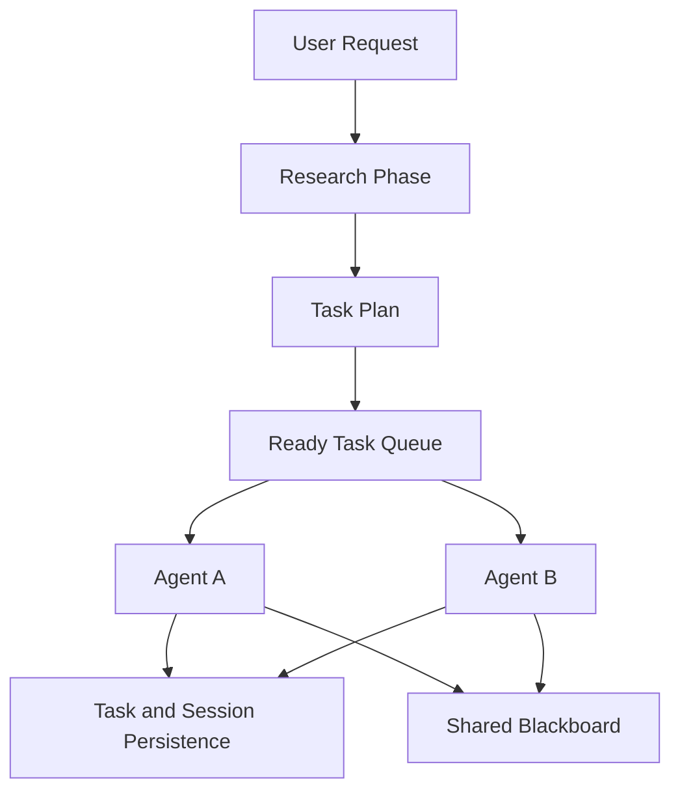

# Swarm And Orchestration

## What It Is

Swarm orchestration is the subsystem that turns a single user request into a coordinated multi-agent workflow. It handles research, planning, task decomposition, agent execution, dependency ordering, file ownership, and task result collection.

This subsystem is distinct from normal single-agent chat. It adds a control plane for parallel work rather than only a single conversational loop.

## Why It Exists

Some tasks are better handled by multiple scoped agents than by one long-running chat:

- a researcher can map the codebase
- a planner can split the work
- implementation agents can own separate files
- reviewers or testers can validate results

The orchestration layer exists to keep those agents coordinated, avoid overlapping edits, and preserve shared knowledge across the swarm session.

## Main Responsibilities

- Initialize swarm state and create the swarm session record.
- Run a research phase to gather candidate files, patterns, and project context.
- Generate a plan with task ownership, dependencies, and role assignments.
- Enforce file-claim boundaries so multiple agents do not edit the same file.
- Start agents as dependency and concurrency limits allow.
- Persist task status, results, and agent stats back into session storage.

## Key Code Locations

- `atls-studio/src/services/orchestrator.ts`: swarm lifecycle, research, planning, task scheduling, agent execution, and prompt construction.
- `atls-studio/src/services/swarmChat.ts`: swarm-specific streaming loop, tool execution, and task completion handling.
- `atls-studio/src/stores/swarmStore.ts`: runtime swarm state for tasks, logs, status, and planning metadata.
- `atls-studio/src/services/chatDb.ts`: persistence of swarm sessions, tasks, and stats.

## Lifecycle

The orchestrator follows a staged workflow:

1. `Research`: gather project context, search results, structural summaries, and candidate edit targets.
2. `Planning`: ask an orchestrator model to decompose the request into scoped tasks.
3. `Execution`: run ready tasks while respecting dependencies and concurrency limits.
4. `Completion`: collect results, persist task outcomes, and mark the swarm session complete or failed.

## Coordination Rules

The orchestrator encodes several important constraints:

- `Exclusive file ownership`: each editable file should belong to one task.
- `Dependency-aware execution`: tasks wait for prerequisite tasks before starting.
- `Preloaded context`: tasks receive relevant owned-file and reference-file manifests.
- `Role-specific prompting`: coder, debugger, reviewer, tester, and documenter roles get different prompt and tool guidance.
- `Terminal isolation`: agents that need shell access can receive dedicated terminals.

These rules are what make the swarm predictable instead of a set of unrelated chats.

## Swarm Streaming

`swarmChat.ts` adapts the normal streaming model to swarm execution:

- it resolves hash references before sending messages
- it executes tool calls during swarm rounds
- it treats `task_complete` as the explicit completion signal
- it classifies blocked tool outcomes separately from clean completion

That means swarm execution is still built on the broader ATLS runtime, but it has its own completion and coordination semantics.

## How It Connects To Other Subsystems

- `Studio App Shell`: the shell exposes the swarm panel and session controls.
- `Session Persistence`: swarm state survives restarts by storing sessions, tasks, results, and stats.
- `Tauri Backend`: research and execution use Tauri-backed code search, file reads, AI streaming, and terminals.
- `Cognitive Runtime`: agents still use ATLS memory, hash refs, and batch tools while working inside the swarm.

## Related Documents

- `ARCHITECTURE.md`
- `docs/studio-app-shell.md`
- `docs/session-persistence.md`
- `docs/tauri-backend.md`
- `docs/batch-executor.md`
- `docs/prompt-assembly.md`
