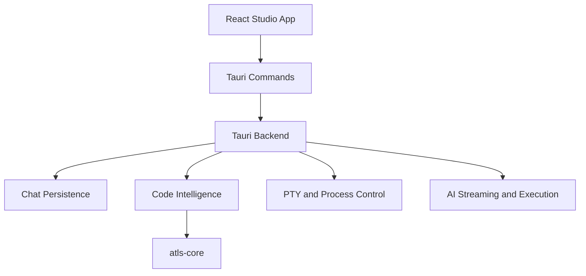

# Tauri Backend

## What It Is

The Tauri backend is the native Rust service layer behind the Studio desktop app. It exposes commands to the TypeScript frontend for filesystem access, code intelligence, edit verification, search, terminal management, AI streaming, and persistence.

This is the main bridge between the React application and the lower-level ATLS engine components in Rust.

## Why It Exists

ATLS needs capabilities that are difficult or unsafe to implement only in the browser layer:

- native filesystem and workspace access
- durable local databases
- verified edit application
- terminal and process control
- code indexing and search through Rust libraries
- direct streaming adapters to model providers

Tauri gives the app a desktop-native boundary while still letting the UI be written in TypeScript.

## Main Responsibilities

- Expose Tauri commands that the frontend can call through `invoke()`.
- Host native services such as file operations, watchers, PTY terminals, search, and build or verify flows.
- Route code intelligence calls into `atls-core`.
- Own the Rust side of chat persistence, hash resolution, and edit verification.
- Provide backend modules for AI execution and streaming.

## Key Code Locations

- `atls-studio/src-tauri/src/lib.rs`: module root and Tauri command registration (see `generate_handler!` invocation at ~3289-3452).
- `atls-studio/src-tauri/src/file_ops.rs`: file reads, writes, and related file operations.
- `atls-studio/src-tauri/src/file_watcher.rs`: file-change watching and event emission.
- `atls-studio/src-tauri/src/atls_ops.rs`: ATLS project operations backed by Rust code intelligence.
- `atls-studio/src-tauri/src/code_intel.rs`: code intelligence entry points.
- `atls-studio/src-tauri/src/search_exec.rs`: search execution.
- `atls-studio/src-tauri/src/refactor_engine.rs`: refactor and edit-oriented backend behavior.
- `atls-studio/src-tauri/src/pty.rs`: terminal and process integration (PTY used with `system.exec` / shell capture paths coordinated from the TypeScript `system` handler).
- `atls-studio/src-tauri/src/ai_execute.rs` and `atls-studio/src-tauri/src/ai_streaming.rs`: provider-facing AI execution and streaming; also owns cache breakpoint placement on the Anthropic tool block.
- `atls-studio/src-tauri/src/gemini_cache.rs`: Gemini / Vertex static-prefix cache create/update/reset and cache-scoped `stream_chat_*` handlers.
- `atls-studio/src-tauri/src/tokenizer.rs`: BPE token counting (`count_tokens`, `count_tokens_batch`, `count_tool_def_tokens`); under `cfg(test)` includes `tokenizer_shorthand_audit.rs` for shorthand-vs-canonical comparisons.
- `atls-studio/src-tauri/src/chat_db_commands.rs` and `atls-studio/src-tauri/src/chat_db.rs`: session persistence and SQLite-backed chat storage (shadow versions, memory snapshots, swarm tasks).
- `atls-studio/src-tauri/src/hash_commands.rs`: hash and UHPP-related backend commands (content registration, revisions, Rust-side hash lookups).
- `atls-studio/src-tauri/src/hash_resolver.rs`: **central `h:` parameter resolver** — expands file-path, content, shape, slice, and diff refs in batch step params before execution so payloads can stay pointer-sized in transcripts while backends see materialized content.
- `atls-studio/src-tauri/src/hash_protocol.rs`: Rust-side HPP types shared with the TypeScript layer.
- `atls-studio/src-tauri/src/edit_session.rs`: edit session state, apply/rollback transactions, preimage verification.
- `atls-studio/src-tauri/src/diff_engine.rs`: unified diff generation used by `h:OLD..h:NEW` refs.
- `atls-studio/src-tauri/src/ast_query.rs`: structured AST queries over the active project's parser registry.
- `atls-studio/src-tauri/src/stream_protocol.rs`: streaming envelope + chunk protocol between provider adapters and the TS layer.
- `atls-studio/src-tauri/src/snapshot.rs`: file/workspace snapshot helpers used by the freshness pipeline.
- `atls-studio/src-tauri/src/shape_ops.rs`: UHPP shape operations (`:sig`, `:fold`, `:dedent`, `:grep`, `:head`/`:tail`, etc.).
- `atls-studio/src-tauri/src/linter.rs`: lint and typecheck runner invocations behind `verify.lint` / `verify.typecheck`.
- `atls-studio/src-tauri/src/git_ops.rs`: git commands (status, diff, history) used by `system.git` and temporal refs (`HEAD~N:path`).
- `atls-studio/src-tauri/src/workspace_run.rs`: workspace script runner wired to `atls_get_workspace_scripts`.
- `atls-studio/src-tauri/src/line_remap.rs`: line-offset helpers (cfg(test)-heavy) supporting cross-step rebase.

## Backend Module Map

At a high level, the backend clusters into these areas:

- `Workspace And File Services`: file I/O, watchers, workspace runs, attachments.
- `ATLS Native Services`: code intelligence, search, refactor, lint, and git support.
- `Chat And Memory Services`: chat DB commands, hash commands, memory-related persistence.
- `AI Runtime Services`: execution, streaming, cache helpers, and model metadata.
- `Terminal Services`: PTY lifecycle and shell integration.

## How It Connects To Other Subsystems

- `Studio App Shell`: the frontend calls this layer with Tauri `invoke()` and listens for backend events.
- `Session Persistence`: persistence-facing commands back the TypeScript `chatDb` service and hydration flows.
- `ATLS Engine`: `src-tauri` depends directly on `atls-rs/crates/atls-core` for indexing, parsing, querying, and project state.
- `Swarm And Orchestration`: orchestration uses Tauri commands for research, streaming, and terminal execution.

## Boundary With `atls-core`

The Tauri backend is not the core engine itself. It is the desktop host and integration layer. `atls-core` provides reusable engine capabilities such as parsing, indexing, querying, and detector loading; `src-tauri` adapts those capabilities into app-facing commands and workflows.

## Related Documents

- [`atls-studio/docs/ARCHITECTURE.md`](../atls-studio/docs/ARCHITECTURE.md)
- [`docs/tauri-commands.md`](./tauri-commands.md) — enumerated `invoke` command names (kept in sync with `lib.rs` `generate_handler!`)
- [`docs/studio-app-shell.md`](./studio-app-shell.md)
- [`docs/session-persistence.md`](./session-persistence.md)
- [`docs/atls-engine.md`](./atls-engine.md)
- [`docs/hash-protocol.md`](./hash-protocol.md)
- [`docs/freshness.md`](./freshness.md)
